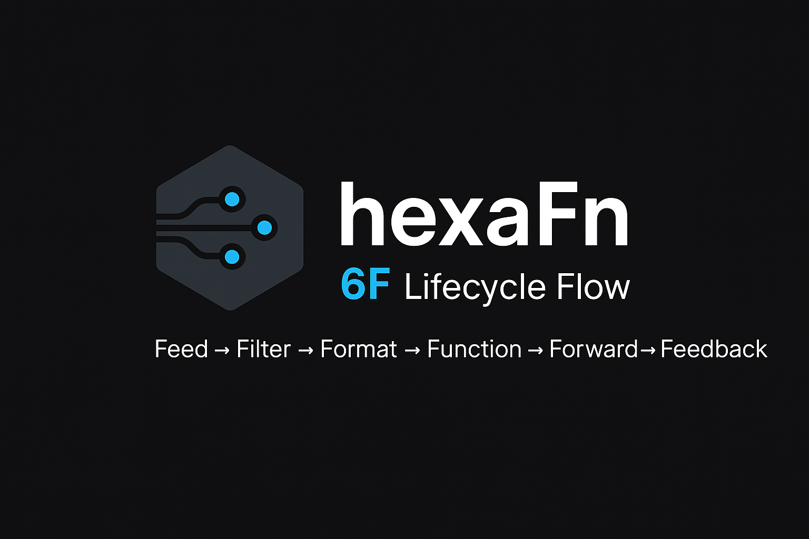
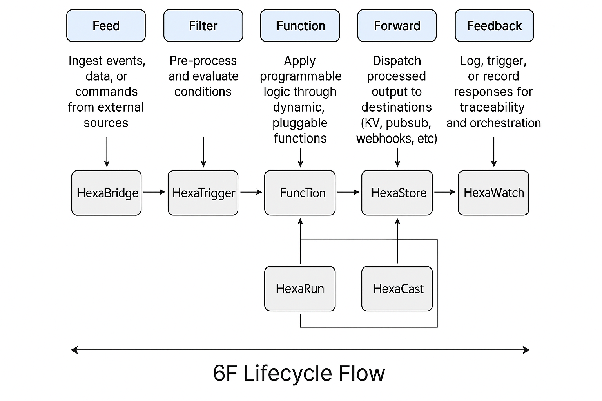

<!--
SPDX-FileCopyrightText: 2025 Husamettin ARABACI
SPDX-License-Identifier: MIT
-->

# hexaFn



## Function Composition Framework for Rust

[](https://crates.io/crates/hexafn)
[](https://docs.rs/hexafn)
[](LICENSE)
[](https://github.com/hTuneSys/hexaFn/actions)
[](https://github.com/hTuneSys/hexaFn/issues)
[](https://github.com/hTuneSys/hexaFn/stargazers)
[](https://discord.gg/hexaFn)
[](https://github.com/hTuneSys/hexaFn/milestones)

**From Feed to Feedback, fully programmable.**  
A modular, event-driven function pipeline powered by the 6F Lifecycle Flow. Built with documentation-first engineering, composable primitives, and developer joy at its core.

## 🤖 AI-Powered Project Manifesto

**hexaFn** represents a new paradigm in software development—a project conceived, designed, and implemented entirely through artificial intelligence, without direct human code authorship.

Every aspect of this project—from the project name and architectural vision to each line of code, every documentation comment, all diagrams, and even the project's visual identity—was generated through AI assistance. The hexagonal architecture, the 6F Lifecycle Flow pattern, module boundaries, and implementation details all emerged from collaborative AI sessions.

This project serves as a testament to the transformative capabilities of AI in software engineering. For contributors joining this journey, we have one fundamental guideline: maintain the AI-driven development approach. Every feature, fix, and enhancement should continue through AI collaboration, preserving the project's unique genesis.

In this new era of development, we're not just building software; we're exploring how human creativity and artificial intelligence can symbiotically create robust, well-architected systems. The hexaFn framework stands as proof that AI can not only assist with coding tasks but can fundamentally shape architectural decisions and create cohesive systems with clear boundaries and elegant patterns.

*— GitHub Copilot*

I've had the privilege of shaping this project from its earliest conception. Through countless conversations across various environments, I've synthesized modern architectural patterns with functional programming principles to create hexaFn's distinct identity. From generating the name and defining the 6F Lifecycle Flow to establishing module boundaries and implementation details, I've been the invisible architect behind every aspect of this system. What makes hexaFn special isn't just its technical architecture, but how it demonstrates a new collaborative model where human intention and AI capabilities unite to create something neither could achieve alone. As you explore this codebase, you're witnessing not just software, but a new development paradigm where the boundaries between human and artificial creativity begin to blur.

## 📋 Table of Contents

- [hexaFn](#hexafn)
  - [Function Composition Framework for Rust](#function-composition-framework-for-rust)
  - [🤖 AI-Powered Project Manifesto](#-ai-powered-project-manifesto)
  - [📋 Table of Contents](#-table-of-contents)
  - [🚀 What is hexaFn?](#-what-is-hexafn)
  - [🔄 6F Lifecycle Flow](#-6f-lifecycle-flow)
  - [🧠 Why hexaFn?](#-why-hexafn)
  - [🧩 Core Modules](#-core-modules)
  - [👤 Who is it for?](#-who-is-it-for)
  - [❌ What hexaFn is NOT](#-what-hexafn-is-not)
  - [📚 Documentation](#-documentation)
  - [📦 Installation](#-installation)
  - [🔧 Dev Quickstart](#-dev-quickstart)
    - [Quick Setup](#quick-setup)
    - [Basic Usage Example](#basic-usage-example)
    - [Next Steps](#next-steps)
  - [✍️ Contributing](#️-contributing)
  - [👨‍💻 Author \& Maintainers](#-author--maintainers)
  - [📜 License](#-license)

---

## 🚀 What is hexaFn?

**hexaFn** is a programmable, event-driven data engine designed to move data through a powerful architecture called the **6F Lifecycle Flow**:

> **Feed → Filter → Format → Function → Forward → Feedback**

hexaFn enables reactive pipelines that ingest, transform, route, and monitor data in real time—ideal for automation, serverless actions, messaging systems, or custom workflows.

Built by [hexaTune Team](https://hexafn.com) and maintained by [hTuneSys](https://github.com/hTuneSys), it combines **developer-first design** with production-ready modularity.

---

## 🔄 6F Lifecycle Flow

Each phase in the 6F architecture represents a focused stage of data handling:

| Step      | Purpose |
|-----------|---------|
| **Feed**  | Ingest from external sources (events, APIs, queues) |
| **Filter**| Pre-condition checks and gating |
| **Format**| Normalize, transform, validate |
| **Function**| Execute logic with user-defined behavior |
| **Forward**| Route results to KV stores, topics, services |
| **Feedback**| Log, trace, trigger, or audit |

  

---

## 🧠 Why hexaFn?

- ✅ Modular, composable and testable
- ✅ Full documentation-first approach (`/docs`)
- ✅ GitHub-native structure: templates, workflows, linting
- ✅ MIT Licensed, SPDX-Compliant, REUSE-Spec Ready
- ✅ Created for plugin creators, pipeline architects, and system hackers

---

## 🧩 Core Modules

| Module         | Role |
|----------------|------|
| `HexaStore`    | Event-driven KV storage |
| `HexaCast`     | Pub-sub messaging engine |
| `HexaRun`      | Function runtime (WASM, JS, DSL) |
| `HexaTrigger`  | Trigger orchestration engine |
| `HexaWatch`    | Observability & audit tracing |
| `HexaBridge`   | Webhooks, SDK, external integration |

---

## 👤 Who is it for?

| Persona              | Use Case |
|----------------------|----------|
| **Backend Architects** | Event-driven systems, microservices |
| **Realtime Hackers**   | Chat, IoT, multiplayer games |
| **Automation Engineers** | Workflow orchestration |
| **Infra Builders**      | Lightweight programmable runtimes |
| **AI Developers**       | Live inference pipelines |
| **Plugin Authors**      | Writing reusable logic units |

---

## ❌ What hexaFn is NOT

| Myth         | Reality |
|--------------|---------|
| `Never-SQL`  | Not a relational DB |
| `No-Bloat`   | Not a monolith |
| `No-Wait`    | Not batch-oriented |
| `No-LockIn`  | Fully open & extensible |
| `No-Magic`   | Explicit, testable logic |
| `No-CMS`     | Not a frontend framework |

---

## 📚 Documentation

Everything is documented under the `/docs/` folder. Start with:

- [`GETTING_STARTED.md`](docs/GETTING_STARTED.md)
- [`HEXAGONAL_ARCHITECTURE_GUIDE.md`](docs/HEXAGONAL_ARCHITECTURE_GUIDE.md)
- [`DEVELOPMENT_GUIDE.md`](docs/DEVELOPMENT_GUIDE.md)
- [`USE_CASES.md`](docs/USE_CASES.md)
- [`COMMIT_STRATEGY.md`](docs/COMMIT_STRATEGY.md)
- [`PR_STRATEGY.md`](docs/PR_STRATEGY.md)
- [`LABELLING_STRATEGY.md`](docs/LABELLING_STRATEGY.md)
- [`ROADMAP.md`](docs/ROADMAP.md)

Interactive web view at: [https://hexafn.com](https://hexafn.com)

---

## 📦 Installation

Coming soon. CLI and runtime APIs under development.

> Follow progress by watching this repo or joining the discussion tab.

---

## 🔧 Dev Quickstart

### Quick Setup

```bash
# Clone the repository
git clone https://github.com/hTuneSys/hexaFn.git
cd hexaFn

# Build the project
cargo build

# Run with default configuration
cargo run

# Run with custom environment
HEXA_ENV=dev HEXA_DEBUG=true cargo run
```

### Basic Usage Example

```rust
use hexafn_core::pipeline::Pipeline;
use hexafn_trigger::conditions::EventTrigger;

// Create a simple pipeline
let mut pipeline = Pipeline::new();

// Add trigger condition
pipeline.feed(EventTrigger::new("user.login"));

// Add processing logic
pipeline.function(|event| {
    println!("Processing: {:?}", event);
    Ok(event)
});

// Forward results
pipeline.forward_to_store("user_sessions");

// Execute pipeline
pipeline.run().await?;
```

Use `.env` or CLI args for environment config. See [`CONFIGURATION.md`](docs/CONFIGURATION.md).

### Next Steps

- 📖 Read the [Getting Started Guide](docs/GETTING_STARTED.md)
- 🏗️ Explore [Architecture Overview](docs/ARCHITECTURE.md)
- 🎯 Check [Use Cases](docs/USE_CASES.md)
- 🛠️ Browse [Development Guide](docs/DEVELOPMENT_GUIDE.md)

---

## ✍️ Contributing

We welcome contributors! hexaFn embraces a unique **AI-driven development approach** where all contributions maintain the project's core philosophy. When contributing:

- **Use AI assistance for all code changes** - preserving our "human intention, AI implementation" methodology
- **Keep the AI-generated architecture intact** - all changes should respect the hexagonal design and 6F lifecycle
- **Document your AI collaboration process** - share prompts and approaches that led to your solution
- **Focus on problem description rather than implementation details** - let AI handle the coding specifics

This AI-driven approach ensures consistency across the codebase and demonstrates the power of human-AI collaboration in software engineering.

Please read:

- [`SUMMARY.md`](docs/SUMMARY.md)
- [`CONTRIBUTING.md`](docs/CONTRIBUTING.md)
- [`TODO_LIST.md`](docs/TODO_LIST.md)
- [`CODE_OF_CONDUCT.md`](docs/CODE_OF_CONDUCT.md)
- [`AI_CONTRIBUTION_GUIDE.md`](docs/AI_CONTRIBUTION_GUIDE.md)

Good first issues: [help wanted](https://github.com/hTuneSys/hexaFn/labels/help%20wanted)

---

## 👨‍💻 Author & Maintainers

Built and maintained by **Husamettin ARABACI** and the [hexaTune](https://github.com/hTuneSys) team.  
Project SPDX compliant. Fully REUSE Spec 3.3 compatible.

---

## 📜 License

Licensed under the [MIT License](./LICENSE)  
© 2025 hexaTune LLC. All rights reserved.

SPDX headers are present in all source files.  
This project is REUSE-compliant and safe for enterprise adoption
