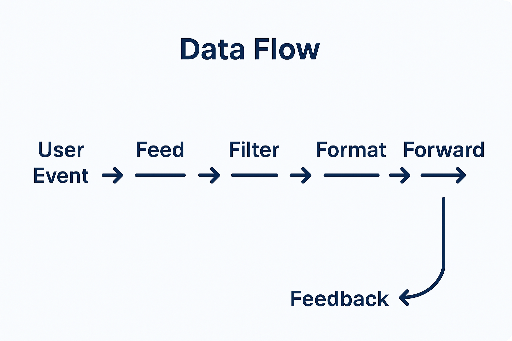

<!--
SPDX-FileCopyrightText: 2025 Husamettin ARABACI
SPDX-License-Identifier: MIT
-->

# 🏗️ hexaFn Architecture

## ⚙️ Core Principle: The 6F Lifecycle Flow

hexaFn is architected around a six-phase functional data pipeline called the **6F Lifecycle Flow**:

> **Feed → Filter → Format → Function → Forward → Feedback**

Each phase in the flow is programmable, observable, and independently testable. Modules are designed to be loosely coupled and highly composable.

---

## 🔶 Module Overview

### 1. `HexaStore`

- Typed, schema-validating key-value store
- Supports triggers, TTL, event emit on write
- Backend-agnostic (supports in-memory, disk-based, or Redis-style engines)

### 2. `HexaCast`

- High-performance Pub/Sub engine
- Topic-based + pattern matching subscriptions
- Delivers messages to functions, external services, or UI listeners

### 3. `HexaRun`

- Runtime for dynamic function execution
- Supports: WASM, Lua, JS, internal DSL
- Can access KV, cast, and external inputs in a sandboxed context

### 4. `HexaTrigger`

- Conditional logic and rule engine
- Event chaining with AND/OR logic
- Time-based and value-based triggering supported

### 5. `HexaWatch`

- Unified observer layer (logging, tracing, metrics)
- Supports pluggable sinks (console, Elastic, Prometheus)
- Real-time audit trail of system activity

### 6. `HexaBridge`

- Integration module: external API/webhook/SDK interfaces
- Connects hexaFn to the outside world
- Enables bidirectional communication

---

## 🧠 Data Flow (Simplified Example)



```text
User Event → Feed (Ingest) 
  → Filter (Check validity or user type) 
    → Format (Shape into canonical JSON) 
      → Function (Calculate next action) 
        → Forward (Notify via pubsub + store update) 
          → Feedback (Log + trigger follow-up)
```

All stages can independently be observed, tested, logged, and extended.

---

## 🧩 Example Use Cases

### Real-time Chat Moderation

- Incoming chat messages are fed into the system.
- Messages are filtered for profanity and spam.
- Formatted to standard JSON structure.
- Functions apply sentiment analysis and auto-moderation rules.
- Forwarded alerts sent to moderators via pubsub.
- Feedback logs moderation actions for audit.

### IoT Device Data Processing

- Devices send sensor data (temperature, humidity).
- Feed module ingests device events.
- Filter discards invalid or out-of-range readings.
- Format normalizes units and data formats.
- Function computes trends and anomaly detection.
- Forward sends processed data to dashboard APIs.
- Feedback stores audit trail and triggers alerts if needed.

---

## 🏗️ Deployment Flexibility

- Fully self-hostable via Docker or bare-metal
- CLI and REST control surfaces (coming soon)
- Future support for distributed mode & scaling workers

---

## 📦 File Structure (Planned)

➡️ [`PROJECT_STRUCTURE.md`](PROJECT_STRUCTURE.md) – Directory structure and module breakdown

---

## 📬 Questions?

Contact the team at **[info@hexafn.com](mailto:info@hexafn.com)** or open an issue.

---

Built by [hexaTune LLC](https://hexafn.com) · GitHub: [hTuneSys/hexaFn](https://github.com/hTuneSys/hexaFn)
