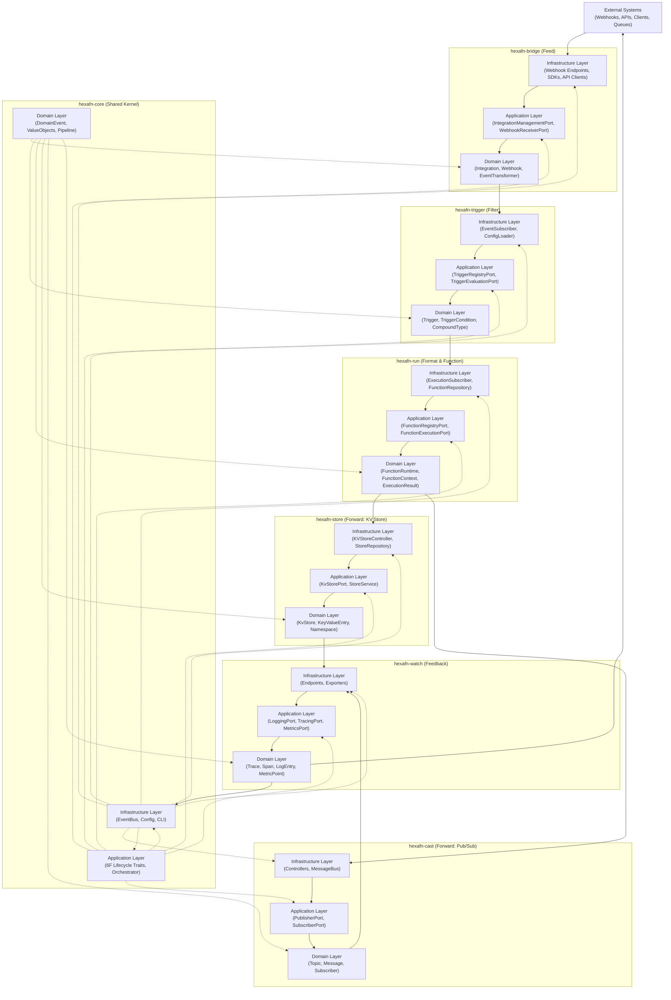

<!--
SPDX-FileCopyrightText: 2025 Husamettin ARABACI
SPDX-License-Identifier: MIT
-->

# 📊 hexaFn Data Flow Overview

This diagram provides a high-level architectural overview of the hexaFn project, showing the relationships and data flows between all main modules and their interaction with external systems. It is designed to align with the 6F Lifecycle Flow (**Feed → Filter → Format → Function → Forward → Feedback**) and the Hexagonal Architecture principles. For detailed component-level diagrams, see `DATA_FLOW_DETAIL.md`.

---

## 🔄 High-Level Architecture Diagram

---

## 📑 Flow Explanation

- **External Systems** send events or requests to the system via the **Bridge** module (Feed phase).
- **Bridge** normalizes and ingests events, passing them to the **Trigger** module (Filter phase).
- **Trigger** evaluates conditions and rules, forwarding valid events to the **Run** module (Format & Function phases).
- **Run** executes user-defined logic/functions, producing results that are sent to **Store** (for persistence) and/or **Cast** (for pub/sub/event broadcasting) in the Forward phase.
- **Store** and **Cast** modules can both emit events or state changes to the **Watch** module (Feedback phase), which handles logging, tracing, and metrics.
- **Watch** provides observability and can export feedback to external monitoring systems.
- The **Core** module provides shared types, orchestration, and event bus infrastructure, supporting all other modules and ensuring architectural consistency.

This high-level diagram ensures clear separation of concerns, strict module boundaries, and a unidirectional data flow that follows the 6F Lifecycle Flow. For detailed component and interface relationships, see `DATA_FLOW_DETAIL.md`.