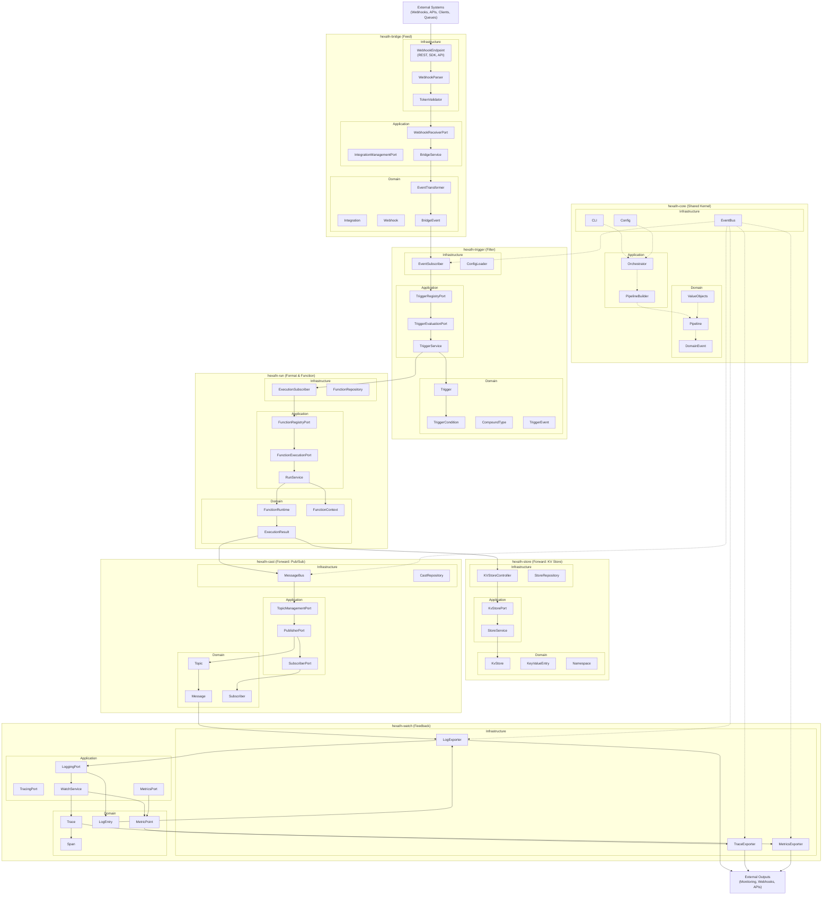

<!-- SPDX-FileCopyrightText: 2025 Husamettin ARABACI -->
<!-- SPDX-License-Identifier: MIT -->

# hexaFn Detailed Component Architecture Diagram

This document provides a detailed, module- and layer-level architecture diagram for the hexaFn project. It strictly follows the 6F Lifecycle Flow (Feed → Filter → Format → Function → Forward → Feedback) and Hexagonal Architecture, and reflects all requirements and data models as defined in DATA_MODEL_*.md and TODO_LIST.md.

---

## 📐 Detailed Module & Layer Architecture

---

## 📝 Explanation

- **Each module** (Bridge, Trigger, Run, Store, Cast, Watch, Core) is shown with its Infrastructure, Application, and Domain layers, as required by Hexagonal Architecture.
- **6F Lifecycle Flow** is strictly followed: Feed (Bridge) → Filter (Trigger) → Format/Function (Run) → Forward (Store/Cast) → Feedback (Watch).
- **Data flow** is unidirectional and modular, with clear boundaries and port/adaptor interfaces between layers.
- **Core module** provides shared types, orchestration, event bus, and pipeline builder, supporting all modules.
- **External systems** interact via Bridge (input) and Watch (output/feedback).
- **All major data structures, ports, and flows** are represented, matching the comprehensive data models and TODO_LIST.md requirements.
- **This diagram and explanation are designed to be exhaustive and production-ready, suitable for onboarding, architecture review, and implementation reference.**