<!--
SPDX-FileCopyrightText: 2025 Husamettin ARABACI
SPDX-License-Identifier: MIT
-->

# hexaFn Detailed Component Architecture Diagram

This diagram illustrates the detailed component architecture of the hexaFn system, including the specific interfaces, structs, methods, and connections between all parts of the system organized according to **Hexagonal Architecture** principles and the **6F Lifecycle Flow**.

## Detailed Component Diagram

```mermaid
flowchart TB
    %% External Input
    ExternalEvent[External Event]

    %% ===== BRIDGE MODULE =====
    subgraph "hexafn-bridge (Feed)"
        subgraph BridgeInfra["Infrastructure"]
            WebhookEndpoint["WebhookController<br>REST adapter"]
            WebhookParser["HttpRequestParser<br>parses HTTP input"]
            TokenValidator["JwtTokenValidator<br>validates token"]
        end

        subgraph BridgeApp["Application"]
            WebhookUseCase["WebhookIngestionPort<br>ingest_event"]
            EventPublishPort["EventPublisherPort<br>publish"]
        end

        subgraph BridgeDomain["Domain"]
            WebhookEvent["WebhookEvent"]
            WebhookSource["WebhookSource"]
            EventTransformer["EventTransformer<br>transform"]
            NormalizationRules["NormalizationRules<br>apply"]
        end

        subgraph BridgeOutboundInfra["Outbound"]
            EventPublisher["KafkaEventPublisher"]
            TopicRouter["TopicRouter<br>route"]
        end
    end

    %% ===== TRIGGER MODULE =====
    subgraph "hexafn-trigger (Filter)"
        subgraph TriggerInfra["Infrastructure"]
            SubscriberAdapter["EventSubscriber"]
            ConfigLoader["YamlConfigLoader"]
        end

        subgraph TriggerApp["Application"]
            TriggerEvalUseCase["TriggerEvaluationPort<br>evaluate"]
            RuleMatchingService["RuleMatchingService<br>match_rules"]
            TriggerRegistryPort["TriggerRegistryPort<br>find_by_id"]
            ExecutionRequestPort["ExecutionRequestPort<br>request_execution"]
        end

        subgraph TriggerDomain["Domain"]
            Trigger["Trigger"]
            TriggerCondition["TriggerCondition"]
            TriggerRule["TriggerRule"]
            TriggerPolicy["TriggerPolicy<br>check_policy"]
            TriggerActivatedEvent["TriggerActivatedEvent"]
        end

        subgraph TriggerOutboundInfra["Outbound"]
            TriggerRepository["InMemoryTriggerRepository"]
            ExecutionRequestPublisher["ExecutionRequestPublisher"]
        end
    end

    %% ===== RUN MODULE =====
    subgraph "hexafn-run (Format + Function)"
        subgraph RunInfra["Infrastructure"]
            ExecutionSubscriber["ExecutionSubscriber"]
            FunctionLoader["FunctionLoader"]
        end

        subgraph RunApp["Application"]
            ExecutionUseCase["FunctionExecutionPort<br>execute"]
            ContextPreparationService["ContextPreparationService<br>prepare"]
            FormatService["FormatService<br>format"]
            RuntimeSelectionService["RuntimeSelectionService<br>select_runtime"]
            ResultProcessingPort["ResultProcessingPort<br>process"]
        end

        subgraph RunDomain["Domain"]
            Function["Function"]
            ExecutionContext["ExecutionContext"]
            RuntimeEnvironment["RuntimeType"]
            FunctionSchema["FunctionSchema"]
            Validator["SchemaValidator<br>validate"]
            FunctionExecutedEvent["FunctionExecutedEvent"]
        end

        subgraph RunOutboundInfra["Outbound"]
            FunctionRepository["FilesystemFunctionRepository"]
            WASMRuntime["WasmtimeRuntime"]
            DSLInterpreter["DSLInterpreter"]
            JSRuntime["QuickJSRuntime"]
            ResultPublisher["ResultPublisher"]
        end
    end

    %% ===== FORWARD PHASE (Store + Cast) =====
    subgraph "hexafn-store"
        subgraph StoreInfra["Infrastructure"]
            StoreAPIController["KVStoreController"]
            ResultSubscriber["ResultSubscriber"]
        end
        subgraph StoreApp["Application"]
            KVStoreUseCase["KVStorePort<br>set/get"]
            KeyValidationService["KeyValidationService"]
            PersistencePort["PersistencePort<br>store"]
            ChangeEventPort["ChangeEventPort<br>emit_change"]
        end
        subgraph StoreDomain["Domain"]
            KVPair["KVPair"]
            Key["Key"]
            Value["Value"]
            Namespace["Namespace"]
            VersionedEntry["VersionedEntry"]
            KVValidator["KVValidator"]
            KVUpdatedEvent["KVUpdatedEvent"]
        end
        subgraph StoreOutboundInfra["Outbound"]
            InMemoryStore["InMemoryStore"]
            RocksDBStore["RocksDBStore"]
            FileSystemStore["FileSystemStore"]
            ChangePublisher["ChangePublisher"]
        end
    end

    subgraph "hexafn-cast"
        subgraph CastInfra["Infrastructure"]
            PublishController["PublishController"]
            SubscriptionController["SubscriptionController"]
            ResultForwarder["ResultForwarder"]
        end
        subgraph CastApp["Application"]
            PublishUseCase["PublisherPort<br>publish"]
            SubscribeUseCase["SubscriberPort<br>subscribe"]
            TopicRoutingService["TopicRoutingService"]
            MessageBusPort["MessageBusPort<br>send"]
            DeliveryStatusPort["DeliveryStatusPort<br>record_status"]
        end
        subgraph CastDomain["Domain"]
            Topic["Topic"]
            Message["Message"]
            Subscriber["Subscriber"]
            TopicFilter["TopicFilter"]
            DeliveryPolicy["DeliveryPolicy"]
            MessageDeliveredEvent["MessageDeliveredEvent"]
        end
        subgraph CastOutboundInfra["Outbound"]
            InMemoryBus["InMemoryBus"]
            RetryManager["RetryManager"]
            DeliveryLogger["DeliveryLogger"]
        end
    end

    %% ===== WATCH MODULE =====
    subgraph "hexafn-watch (Feedback)"
        subgraph WatchInfra["Infrastructure"]
            MetricsEndpoint["MetricsEndpoint"]
            LogSubscriber["LogSubscriber"]
            TracingHook["TracingHook"]
        end
        subgraph WatchApp["Application"]
            LoggingUseCase["LoggingPort<br>log"]
            TracingUseCase["TracingPort<br>span ops"]
            MetricsUseCase["MetricsPort<br>record"]
            AlertingService["AlertingService"]
            ObservabilityPort["ObservabilityPort<br>export"]
        end
        subgraph WatchDomain["Domain"]
            Trace["Trace"]
            Span["Span"]
            LogEntry["LogEntry"]
            MetricPoint["MetricPoint"]
            TraceCorrelator["TraceCorrelator"]
            AnomalyDetector["AnomalyDetector"]
            AlertTriggeredEvent["AlertTriggeredEvent"]
        end
        subgraph WatchOutboundInfra["Outbound"]
            StructuredLogger["JsonLogger"]
            PrometheusExporter["PrometheusClient"]
            TracingExporter["OTelExporter"]
            AlertNotifier["AlertNotifier"]
        end
    end

    %% ===== CORE MODULE (Shared Kernel) =====
    subgraph "hexafn-core"
        subgraph CoreDomain["Domain Layer"]
            %% Domain Contracts
            EventContract["trait Event<br>event_type(), event_id(), timestamp(), payload()"]
            DomainEventContract["trait DomainEvent<br>aggregate_id(), sequence_number(), occurred_at(), correlation_id()"]
            PipelineContract["trait Pipeline<br>execute(), add_stage(), get_stages(), build(), validate()"]
            ErrorContract["trait HexaError<br>error_code(), error_message(), kind(), severity(), source()"]
            
            %% Domain Value Objects
            EventId["EventId<br>new(), from_string(), to_string()"]
            PipelineStageType["enum PipelineStageType<br>Feed, Filter, Format, Function, Forward, Feedback"]
            HexaErrorKind["enum HexaErrorKind<br>NotFound, Validation, Timeout, Internal, External, Unknown"]
            HexaErrorSeverity["enum HexaErrorSeverity<br>Low, Medium, High, Critical"]
            
            %% Domain Entities
            PipelineContext["PipelineContext<br>data: HashMap, get(), set(), clone()"]
        end
        
        subgraph CoreApp["Application Layer"]
            %% 6F Lifecycle Traits
            FeedTrait["trait Feed<br>ingest(input: T) -> Result<Event, Error>"]
            FilterTrait["trait Filter<br>apply(event: Event) -> Result<bool, Error>"]
            FormatTrait["trait Format<br>transform(event: Event) -> Result<Event, Error>"]
            FunctionTrait["trait Function<br>execute(context: Context) -> Result<Output, Error>"]
            ForwardTrait["trait Forward<br>deliver(output: Output) -> Result<(), Error>"]
            FeedbackTrait["trait Feedback<br>observe(result: Result) -> Result<(), Error>"]
            
            %% Pipeline Management
            PipelineBuilder["PipelineBuilder<br>feed(), filter(), format(), function(), forward(), feedback(), build()"]
            PipelineExecutor["PipelineExecutor<br>execute_stage(), handle_error(), propagate_context()"]
            
            %% Event Processing
            EventProcessor["EventProcessor<br>process(), validate(), enrich()"]
            EventRouter["EventRouter<br>route_to_stage(), determine_next_stage()"]
        end
        
        subgraph CoreInfra["Infrastructure Layer"]
            %% Configuration Management
            ConfigManager["ConfigManager<br>load(), reload(), validate_config()"]
            EnvironmentLoader["EnvironmentLoader<br>load_env(), parse_vars()"]
            
            %% Event Bus Integration
            CoreEventBus["CoreEventBus<br>publish(), subscribe(), unsubscribe()"]
            EventSerializer["EventSerializer<br>serialize(), deserialize()"]
            
            %% Error Handling
            ErrorHandler["ErrorHandler<br>handle(), log_error(), recover()"]
            ErrorReporter["ErrorReporter<br>report(), format_error()"]
            
            %% Metrics & Telemetry
            CoreMetrics["CoreMetrics<br>record_pipeline_execution(), track_stage_duration()"]
            TelemetryCollector["TelemetryCollector<br>collect(), export()"]
        end
    end

    %% Core Module Connections to Other Modules
    CoreDomain -.-> BridgeDomain
    CoreDomain -.-> TriggerDomain
    CoreDomain -.-> RunDomain
    CoreDomain -.-> StoreDomain
    CoreDomain -.-> CastDomain
    CoreDomain -.-> WatchDomain
    
    CoreApp -.-> BridgeApp
    CoreApp -.-> TriggerApp
    CoreApp -.-> RunApp
    CoreApp -.-> StoreApp
    CoreApp -.-> CastApp
    CoreApp -.-> WatchApp
    
    CoreInfra -.-> BridgeInfra
    CoreInfra -.-> TriggerInfra
    CoreInfra -.-> RunInfra
    CoreInfra -.-> StoreInfra
    CoreInfra -.-> CastInfra
    CoreInfra -.-> WatchInfra

    %% Data Flow Connections
    ExternalEvent --> WebhookEndpoint
    TopicRouter --> SubscriberAdapter
    ExecutionRequestPublisher --> ExecutionSubscriber
    ResultPublisher --> ResultSubscriber
    ResultPublisher --> ResultForwarder
    ChangePublisher --> LogSubscriber
    DeliveryLogger --> LogSubscriber
    AlertNotifier --> ExternalOutput["External Output"]
    TopicRouter --> ExternalOutput
    ResultPublisher --> ExternalOutput
```

## Architecture Explanation

This detailed component diagram shows:

1. **Complete Component Details**: All struct definitions, trait interfaces, methods, and connections.

2. **Hexagonal Architecture Layers**:
   - **Infrastructure Layer**: Handles external concerns and implements adapters
   - **Application Layer**: Contains use cases and port definitions
   - **Domain Layer**: Houses core business rules and models

3. **6F Lifecycle Organization**:
   - **Feed Phase**: Data ingestion (hexafn-bridge)
   - **Filter Phase**: Condition checking (hexafn-trigger)
   - **Format & Function Phases**: Data transformation and execution (hexafn-run)
   - **Forward Phase**: Result delivery (hexafn-store, hexafn-cast)
   - **Feedback Phase**: Observability and audit (hexafn-watch)

4. **Data Flow**: Event flow from external ingestion through the entire system.

5. **Core Module**: Shared kernel providing common traits, interfaces, and pipelines.

The architecture follows clean separation of concerns with domain-driven design principles while enabling flexible composition through the 6F Lifecycle Flow model.