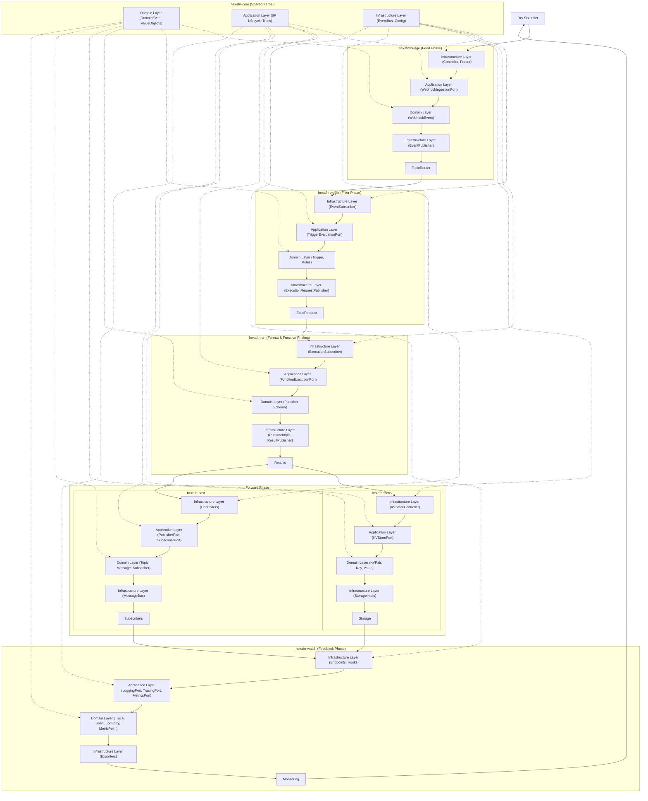

<!--
SPDX-FileCopyrightText: 2025 Husamettin ARABACI
SPDX-License-Identifier: MIT
-->

# 📊 hexaFn Data Flow Example

This diagram illustrates the complete data flow through all hexaFn modules, organized according to the **6F Lifecycle Phases** and **Hexagonal Architecture layers**.

## 🔄 Complete Flow Diagram

## 📑 Flow Explanation

This diagram shows how data flows through the complete hexaFn system following the **6F Lifecycle Flow**:

1. **Feed** (hexafn-bridge): External systems send data to the Bridge module, which ingests it
2. **Filter** (hexafn-trigger): The Trigger module evaluates conditions and rules on the data
3. **Format & Function** (hexafn-run): The Run module formats data and executes the appropriate function
4. **Forward** (hexafn-store, hexafn-cast): Results are forwarded to storage or messaging systems
5. **Feedback** (hexafn-watch): The Watch module provides observability and monitoring

The **hexafn-core** module acts as a shared kernel, providing common functionality to all other modules.

Each module follows **Hexagonal Architecture** with clearly separated:
- Infrastructure Layer (adapters for external systems)
- Application Layer (use cases and ports)
- Domain Layer (business logic and entities)

This architecture ensures that business logic is decoupled from external concerns and can be tested independently.