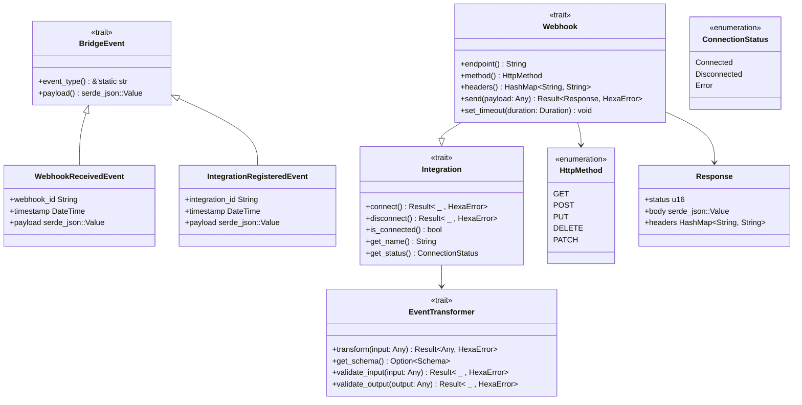
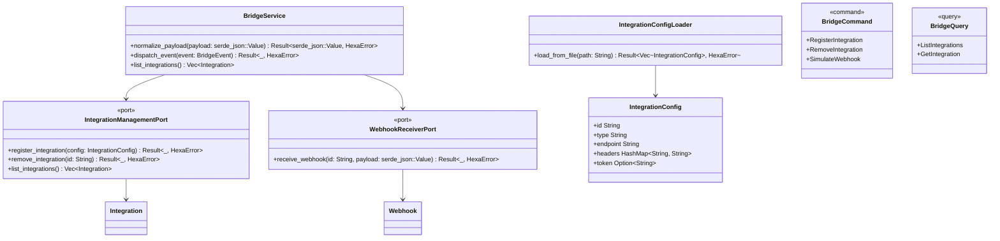
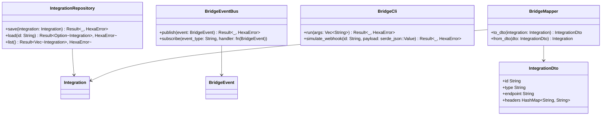

<!--
SPDX-FileCopyrightText: 2025 Husamettin ARABACI
SPDX-License-Identifier: MIT
-->

# Bridge Module (HexaBridge)

## Domain Layer

```mermaid
classDiagram
    class Integration {
        <<trait>>
        +connect() Result~ _ , HexaError~
        +disconnect() Result~ _ , HexaError~
        +is_connected() bool
        +get_name() String
        +get_status() ConnectionStatus
    }
    class Webhook {
        <<trait>>
        +endpoint() String
        +method() HttpMethod
        +headers() HashMap~String, String~
        +send(payload: Any) Result~Response, HexaError~
        +set_timeout(duration: Duration) void
    }
    class EventTransformer {
        <<trait>>
        +transform(input: Any) Result~Any, HexaError~
        +get_schema() Option~Schema~
        +validate_input(input: Any) Result~ _ , HexaError~
        +validate_output(output: Any) Result~ _ , HexaError~
    }
    class BridgeEvent {
        <<trait>>
        +event_type() &'static str
        +payload() serde_json::Value
    }
    class WebhookReceivedEvent {
        +webhook_id String
        +timestamp DateTime
        +payload serde_json::Value
    }
    class IntegrationRegisteredEvent {
        +integration_id String
        +timestamp DateTime
        +payload serde_json::Value
    }
    class ConnectionStatus {
        <<enumeration>>
        Connected
        Disconnected
        Error
    }
    class HttpMethod {
        <<enumeration>>
        GET
        POST
        PUT
        DELETE
        PATCH
    }
    class Response {
        +status u16
        +body serde_json::Value
        +headers HashMap~String, String~
    }
    Integration --> EventTransformer
    Webhook --|> Integration
    Webhook --> HttpMethod
    Webhook --> Response
    BridgeEvent <|-- WebhookReceivedEvent
    BridgeEvent <|-- IntegrationRegisteredEvent
```

## Application Layer

```mermaid
classDiagram
    class IntegrationManagementPort {
        <<port>>
        +register_integration(config: IntegrationConfig) Result~_, HexaError~
        +remove_integration(id: String) Result~_, HexaError~
        +list_integrations() Vec~Integration~
    }
    class WebhookReceiverPort {
        <<port>>
        +receive_webhook(id: String, payload: serde_json::Value) Result~_, HexaError~
    }
    class BridgeService {
        +normalize_payload(payload: serde_json::Value) Result~serde_json::Value, HexaError~
        +dispatch_event(event: BridgeEvent) Result~_, HexaError~
        +list_integrations() Vec~Integration~
    }
    class IntegrationConfigLoader {
        +load_from_file(path: String) Result~Vec~IntegrationConfig~, HexaError~
    }
    class IntegrationConfig {
        +id String
        +type String
        +endpoint String
        +headers HashMap~String, String~
        +token Option~String~
    }
    class BridgeCommand {
        <<command>>
        +RegisterIntegration
        +RemoveIntegration
        +SimulateWebhook
    }
    class BridgeQuery {
        <<query>>
        +ListIntegrations
        +GetIntegration
    }
    IntegrationManagementPort --> Integration
    WebhookReceiverPort --> Webhook
    BridgeService --> IntegrationManagementPort
    BridgeService --> WebhookReceiverPort
    IntegrationConfigLoader --> IntegrationConfig
```

## Infrastructure Layer

```mermaid
classDiagram
    class IntegrationRepository {
        +save(integration: Integration) Result~_, HexaError~
        +load(id: String) Result~Option~Integration~, HexaError~
        +list() Result~Vec~Integration~, HexaError~
    }
    class BridgeEventBus {
        +publish(event: BridgeEvent) Result~_, HexaError~
        +subscribe(event_type: String, handler: fn(BridgeEvent))
    }
    class BridgeCli {
        +run(args: Vec~String~) Result~_, HexaError~
        +simulate_webhook(id: String, payload: serde_json::Value) Result~_, HexaError~
    }
    class IntegrationDto {
        +id String
        +type String
        +endpoint String
        +headers HashMap~String, String~
    }
    class BridgeMapper {
        +to_dto(integration: Integration) IntegrationDto
        +from_dto(dto: IntegrationDto) Integration
    }
    IntegrationRepository --> Integration
    BridgeEventBus --> BridgeEvent
    BridgeMapper --> IntegrationDto
    BridgeMapper --> Integration
```

---

