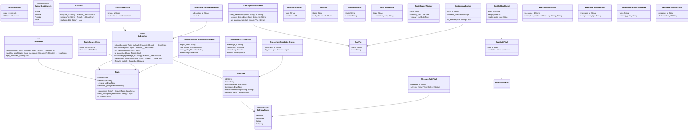
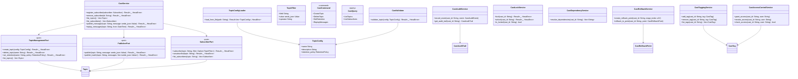
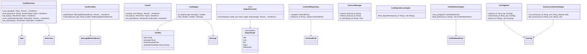

<!--
SPDX-FileCopyrightText: 2025 Husamettin ARABACI
SPDX-License-Identifier: MIT
-->

# Cast Module (HexaCast)

## Domain Layer

```mermaid
classDiagram
    class Topic {
        +name String
        +description String
        +created_at DateTime
        +retention_policy RetentionPolicy
        +new(name: String) Result~Topic, HexaError~
        +with_description(description: String) Topic
        +is_valid() bool
    }
    class RetentionPolicy {
        +max_events u64
        +ttl Option~Duration~
    }
    class Publisher {
        <<trait>>
        +publish(topic: Topic, message: Any) Result~ _ , HexaError~
        +publish_batch(topic: Topic, messages: Vec~Any~) Result~ _ , HexaError~
        +get_published_count() u64
    }
    class Subscriber {
        <<trait>>
        +subscribe(topic: Topic, callback: fn(Any)) Result~ _ , HexaError~
        +unsubscribe(topic: Topic) Result~ _ , HexaError~
        +get_subscriptions() Vec~Topic~
        +is_subscribed(topic: Topic) bool
        +acknowledge(message_id: String) Result~_, HexaError~
        +replay(topic: Topic, from: DateTime) Result~_, HexaError~
        +lifecycle_state() SubscriberLifecycle
    }
    class SubscriberLifecycle {
        <<enumeration>>
        Active
        Inactive
        Pending
        Error
    }
    class Message {
        +id String
        +topic String
        +payload serde_json::Value
        +timestamp DateTime
        +metadata HashMap~String, String~
        +delivery_status DeliveryStatus
    }
    class DeliveryStatus {
        <<enumeration>>
        Pending
        Delivered
        Failed
        Retrying
    }
    class MessageDeliveredEvent {
        +message_id String
        +subscriber_id String
        +timestamp DateTime
        +status DeliveryStatus
    }
    class TopicCreatedEvent {
        +topic_name String
        +timestamp DateTime
    }
    class TopicRetentionPolicyChangedEvent {
        +topic_name String
        +old_policy RetentionPolicy
        +new_policy RetentionPolicy
        +timestamp DateTime
    }
    class CastAuditTrail {
        +cast_id String
        +events Vec~CastAuditEvent~
    }
    class CastLock {
        +acquire(id: String) Result~_, HexaError~
        +release(id: String) Result~_, HexaError~
        +is_locked(id: String) bool
    }
    class CastDependencyGraph {
        +add_dependency(from: String, to: String)
        +remove_dependency(from: String, to: String)
        +get_dependencies(id: String) Vec~String~
    }
    class CastRollbackPoint {
        +cast_id String
        +stage_index u32
        +state serde_json::Value
    }
    class CastTag {
        +name String
        +color String
    }
    class CastAccessControl {
        +cast_id String
        +allowed_roles Vec~String~
        +is_allowed(user: String) bool
    }
    class TopicPartitioning {
        +topic String
        +partitions u32
    }
    class TopicACL {
        +topic String
        +acl_rules Vec~AclRule~
    }
    class TopicVersioning {
        +topic String
        +version String
    }
    class TopicCompaction {
        +topic String
        +compaction_policy String
    }
    class TopicReplayWindow {
        +topic String
        +window_start DateTime
        +window_end DateTime
    }
    class SubscriberGroup {
        +group_id String
        +subscribers Vec~Subscriber~
    }
    class SubscriberOffsetManagement {
        +subscriber_id String
        +offset u64
    }
    class SubscriberDeadLetterQueue {
        +subscriber_id String
        +dlq_messages Vec~Message~
    }
    class MessageEncryption {
        +message_id String
        +encryption_metadata HashMap~String, String~
    }
    class MessageCompression {
        +message_id String
        +compression_type String
    }
    class MessageOrderingGuarantee {
        +topic String
        +ordering_policy String
    }
    class MessageDeduplication {
        +message_id String
        +deduplication_id String
    }
    class MessageAuditTrail {
        +message_id String
        +delivery_history Vec~DeliveryStatus~
    }
    Publisher --> Topic
    Subscriber --> Topic
    Subscriber --> Message
    Message --> DeliveryStatus
    MessageDeliveredEvent --> Message
    TopicCreatedEvent --> Topic
    TopicRetentionPolicyChangedEvent --> Topic
    CastAuditTrail --> CastAuditEvent
    CastDependencyGraph --> CastTag
    CastRollbackPoint --> CastAuditTrail
    CastAccessControl --> CastTag
    SubscriberGroup --> Subscriber
    SubscriberOffsetManagement --> Subscriber
    SubscriberDeadLetterQueue --> Message
    MessageAuditTrail --> DeliveryStatus
```

## Application Layer

```mermaid
classDiagram
    class TopicManagementPort {
        <<port>>
        +create_topic(config: TopicConfig) Result~_, HexaError~
        +delete_topic(name: String) Result~_, HexaError~
        +set_retention(name: String, policy: RetentionPolicy) Result~_, HexaError~
        +list_topics() Vec~Topic~
    }
    class PublisherPort {
        <<port>>
        +publish(topic: String, message: serde_json::Value) Result~_, HexaError~
        +publish_batch(topic: String, messages: Vec~serde_json::Value~) Result~_, HexaError~
    }
    class SubscriberPort {
        <<port>>
        +subscribe(topic: String, filter: Option~TopicFilter~) Result~_, HexaError~
        +unsubscribe(topic: String) Result~_, HexaError~
        +list_subscribers(topic: String) Vec~Subscriber~
    }
    class CastService {
        +register_subscriber(subscriber: Subscriber) Result~_, HexaError~
        +remove_subscriber(id: String) Result~_, HexaError~
        +list_topics() Vec~Topic~
        +list_subscribers() Vec~Subscriber~
        +publish_message(topic: String, message: serde_json::Value) Result~_, HexaError~
        +replay_messages(topic: String, from: DateTime) Result~_, HexaError~
    }
    class TopicConfigLoader {
        +load_from_file(path: String) Result~Vec~TopicConfig~, HexaError~
    }
    class TopicConfig {
        +name String
        +description String
        +retention_policy RetentionPolicy
    }
    class TopicFilter {
        +field String
        +value serde_json::Value
        +operator String
    }
    class CastCommand {
        <<command>>
        +CreateTopic
        +DeleteTopic
        +SetRetention
        +ReplayMessages
    }
    class CastQuery {
        <<query>>
        +ListTopics
        +ListSubscribers
    }
    class CastValidator {
        +validate_topic(config: TopicConfig) Result~_, HexaError~
    }
    class CastAuditService {
        +record_event(cast_id: String, event: CastAuditEvent)
        +get_audit_trail(cast_id: String) CastAuditTrail
    }
    class CastLockService {
        +lock(cast_id: String) Result~_, HexaError~
        +unlock(cast_id: String) Result~_, HexaError~
        +is_locked(cast_id: String) bool
    }
    class CastDependencyService {
        +resolve_dependencies(cast_id: String) Vec~String~
    }
    class CastRollbackService {
        +create_rollback_point(cast_id: String, stage_index: u32)
        +rollback_to_point(cast_id: String, point: CastRollbackPoint)
    }
    class CastTaggingService {
        +add_tag(cast_id: String, tag: CastTag)
        +remove_tag(cast_id: String, tag: CastTag)
        +list_tags(cast_id: String) Vec~CastTag~
    }
    class CastAccessControlService {
        +grant_access(cast_id: String, user: String)
        +revoke_access(cast_id: String, user: String)
        +check_access(cast_id: String, user: String) bool
    }
    TopicManagementPort --> Topic
    PublisherPort --> Topic
    SubscriberPort --> Topic
    CastService --> TopicManagementPort
    CastService --> PublisherPort
    CastService --> SubscriberPort
    TopicConfigLoader --> TopicConfig
    CastValidator --> TopicConfig
    CastAuditService --> CastAuditTrail
    CastRollbackService --> CastRollbackPoint
    CastTaggingService --> CastTag
    CastAccessControlService --> CastTag
```

## Infrastructure Layer

```mermaid
classDiagram
    class CastRepository {
        +save_topic(topic: Topic) Result~_, HexaError~
        +load_topic(name: String) Result~Option~Topic~, HexaError~
        +list_topics() Result~Vec~Topic~, HexaError~
        +save_subscriber(subscriber: Subscriber) Result~_, HexaError~
        +list_subscribers() Result~Vec~Subscriber~, HexaError~
    }
    class CastEventBus {
        +publish(event: MessageDeliveredEvent) Result~_, HexaError~
        +subscribe(event_type: String, handler: fn(MessageDeliveredEvent))
    }
    class CastCli {
        +run(args: Vec~String~) Result~_, HexaError~
        +list_topics() Result~Vec~Topic~, HexaError~
        +list_subscribers() Result~Vec~Subscriber~, HexaError~
    }
    class CastDto {
        +topic String
        +message String
        +timestamp DateTime
        +metadata HashMap~String, String~
    }
    class CastMapper {
        +to_dto(message: Message) CastDto
        +from_dto(dto: CastDto) Message
    }
    class OutputForwarder {
        <<trait>>
        +forward(output: serde_json::Value, target: OutputTarget) Result~_, HexaError~
    }
    class OutputTarget {
        <<enumeration>>
        Http
        Cast
        File
        Kafka
        WebSocket
    }
    class CastAuditRepository {
        +save(trail: CastAuditTrail)
        +load(cast_id: String) Option~CastAuditTrail~
    }
    class CastLockManager {
        +acquire_lock(cast_id: String)
        +release_lock(cast_id: String)
        +is_locked(cast_id: String) bool
    }
    class CastDependencyAdapter {
        +fetch_dependencies(cast_id: String) Vec~String~
    }
    class CastRollbackAdapter {
        +save_point(point: CastRollbackPoint)
        +load_points(cast_id: String) Vec~CastRollbackPoint~
    }
    class CastTagStore {
        +add(cast_id: String, tag: CastTag)
        +remove(cast_id: String, tag: CastTag)
        +list(cast_id: String) Vec~CastTag~
    }
    class CastAccessControlAdapter {
        +set_access(cast_id: String, user: String, allowed: bool)
        +get_access(cast_id: String, user: String) bool
    }
    CastRepository --> Topic
    CastRepository --> Subscriber
    CastEventBus --> MessageDeliveredEvent
    CastMapper --> CastDto
    CastMapper --> Message
    OutputForwarder --> OutputTarget
    CastAuditRepository --> CastAuditTrail
    CastRollbackAdapter --> CastRollbackPoint
    CastTagStore --> CastTag
    CastAccessControlAdapter --> CastTag
```
