<!--
SPDX-FileCopyrightText: 2025 Husamettin ARABACI
SPDX-License-Identifier: MIT
-->

# hexaFn Data Model

This document provides a comprehensive, production-ready data model for the hexaFn project, covering all 6 main modules (Core, Trigger, Store, Cast, Watch, Bridge, Run) and all Hexagonal Architecture layers (Domain, Application, Infrastructure). It includes all required entities, traits, ports, adapters, services, repositories, DTOs, mappers, event flows, CLI/config/orchestrator abstractions, and advanced features as required by the issue list and project milestones.

---

# Core Module (Shared Kernel)

## Domain Layer

## Application Layer

## Infrastructure Layer

```mermaid
classDiagram
    class PipelineCli {
        +run(args: Vec~String~) Result~_, HexaError~
        +reload() Result~_, HexaError~
        +list() Result~Vec~PipelineInstance~, HexaError~
    }
    class PipelineRepository {
        +save(instance: PipelineInstance) Result~_, HexaError~
        +load(id: String) Result~Option~PipelineInstance~, HexaError~
        +list() Result~Vec~PipelineInstance~, HexaError~
    }
    class PipelineEventBus {
        +publish(event: CoreDomainEvent) Result~_, HexaError~
        +subscribe(event_type: String, handler: fn(CoreDomainEvent))
    }
    class PipelineDto {
        +id String
        +status String
        +stages Vec~String~
        +metadata HashMap~String, String~
    }
    class PipelineMapper {
        +to_dto(instance: PipelineInstance) PipelineDto
        +from_dto(dto: PipelineDto) PipelineInstance
    }
    class PipelineAuditRepository {
        +save(trail: PipelineAuditTrail)
        +load(pipeline_id: String) Option~PipelineAuditTrail~
    }
    class PipelineLockManager {
        +acquire_lock(pipeline_id: String)
        +release_lock(pipeline_id: String)
        +is_locked(pipeline_id: String) bool
    }
    class PipelineDependencyAdapter {
        +fetch_dependencies(pipeline_id: String) Vec~String~
    }
    class PipelineRollbackAdapter {
        +save_point(point: PipelineRollbackPoint)
        +load_points(pipeline_id: String) Vec~PipelineRollbackPoint~
    }
    class PipelineTagStore {
        +add(pipeline_id: String, tag: PipelineTag)
        +remove(pipeline_id: String, tag: PipelineTag)
        +list(pipeline_id: String) Vec~PipelineTag~
    }
    class PipelineAccessControlAdapter {
        +set_access(pipeline_id: String, user: String, allowed: bool)
        +get_access(pipeline_id: String, user: String) bool
    }
    PipelineCli --> PipelineOrchestrator
    PipelineRepository --> PipelineInstance
    PipelineEventBus --> CoreDomainEvent
    PipelineMapper --> PipelineDto
    PipelineMapper --> PipelineInstance
```

---

---

# Developer Tooling & Test Abstractions

---

# Cross-Module Event Flows & Orchestration

---

This model is designed to be exhaustive and production-ready, covering all layers, flows, and advanced features required by the hexaFn project and its roadmap.
