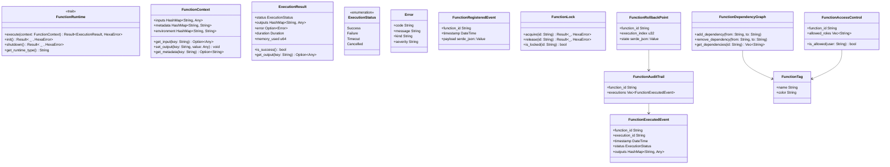
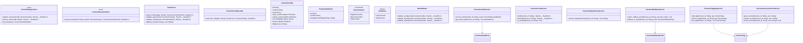
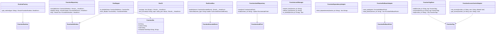

<!--
SPDX-FileCopyrightText: 2025 Husamettin ARABACI
SPDX-License-Identifier: MIT
-->

# Run Module (HexaRun)

## Domain Layer

```mermaid
classDiagram
    class FunctionRuntime {
        <<trait>>
        +execute(context: FunctionContext) Result~ExecutionResult, HexaError~
        +init() Result~ _ , HexaError~
        +shutdown() Result~ _ , HexaError~
        +get_runtime_type() String
    }
    class FunctionContext {
        +inputs HashMap~String, Any~
        +metadata HashMap~String, String~
        +environment HashMap~String, String~
        +get_input(key: String) Option~Any~
        +set_output(key: String, value: Any) void
        +get_metadata(key: String) Option~String~
    }
    class ExecutionResult {
        +status ExecutionStatus
        +outputs HashMap~String, Any~
        +error Option~Error~
        +duration Duration
        +memory_used u64
        +is_success() bool
        +get_output(key: String) Option~Any~
    }
    class ExecutionStatus {
        <<enumeration>>
        Success
        Failure
        Timeout
        Cancelled
    }
    class Error {
        +code String
        +message String
        +kind String
        +severity String
    }
    class FunctionRegisteredEvent {
        +function_id String
        +timestamp DateTime
        +payload serde_json::Value
    }
    class FunctionExecutedEvent {
        +function_id String
        +execution_id String
        +timestamp DateTime
        +status ExecutionStatus
        +outputs HashMap~String, Any~
    }
    class FunctionAuditTrail {
        +function_id String
        +executions Vec~FunctionExecutedEvent~
    }
    class FunctionLock {
        +acquire(id: String) Result~_, HexaError~
        +release(id: String) Result~_, HexaError~
        +is_locked(id: String) bool
    }
    class FunctionDependencyGraph {
        +add_dependency(from: String, to: String)
        +remove_dependency(from: String, to: String)
        +get_dependencies(id: String) Vec~String~
    }
    class FunctionRollbackPoint {
        +function_id String
        +execution_index u32
        +state serde_json::Value
    }
    class FunctionTag {
        +name String
        +color String
    }
    class FunctionAccessControl {
        +function_id String
        +allowed_roles Vec~String~
        +is_allowed(user: String) bool
    }
    FunctionAuditTrail --> FunctionExecutedEvent
    FunctionDependencyGraph --> FunctionTag
    FunctionRollbackPoint --> FunctionAuditTrail
    FunctionAccessControl --> FunctionTag
```

## Application Layer

```mermaid
classDiagram
    class FunctionRegistryPort {
        <<port>>
        +register_function(config: FunctionConfig) Result~_, HexaError~
        +remove_function(id: String) Result~_, HexaError~
        +list_functions() Vec~FunctionDefinition~
    }
    class FunctionExecutionPort {
        <<port>>
        +execute_function(id: String, context: FunctionContext) Result~ExecutionResult, HexaError~
    }
    class RunService {
        +select_runtime(type: String) Result~FunctionRuntime, HexaError~
        +validate_input(context: FunctionContext) Result~_, HexaError~
        +validate_output(result: ExecutionResult) Result~_, HexaError~
        +fallback_chain(id: String) Vec~String~
    }
    class FunctionConfigLoader {
        +load_from_file(path: String) Result~Vec~FunctionConfig~, HexaError~
    }
    class FunctionConfig {
        +id String
        +runtime String
        +code String
        +input_schema Option~Schema~
        +output_schema Option~Schema~
        +env HashMap~String, String~
        +timeout Option~Duration~
        +fallback Vec~String~
    }
    class FunctionDefinition {
        +id String
        +runtime String
        +metadata HashMap~String, String~
    }
    class RunCommand {
        <<command>>
        +RegisterFunction
        +RemoveFunction
        +TestFunction
    }
    class RunQuery {
        <<query>>
        +ListFunctions
        +GetFunction
    }
    class RunValidator {
        +validate_config(config: FunctionConfig) Result~_, HexaError~
        +validate_input(context: FunctionContext) Result~_, HexaError~
        +validate_output(result: ExecutionResult) Result~_, HexaError~
    }
    class FunctionAuditService {
        +record_event(function_id: String, event: FunctionExecutedEvent)
        +get_audit_trail(function_id: String) FunctionAuditTrail
    }
    class FunctionLockService {
        +lock(function_id: String) Result~_, HexaError~
        +unlock(function_id: String) Result~_, HexaError~
        +is_locked(function_id: String) bool
    }
    class FunctionDependencyService {
        +resolve_dependencies(function_id: String) Vec~String~
    }
    class FunctionRollbackService {
        +create_rollback_point(function_id: String, execution_index: u32)
        +rollback_to_point(function_id: String, point: FunctionRollbackPoint)
    }
    class FunctionTaggingService {
        +add_tag(function_id: String, tag: FunctionTag)
        +remove_tag(function_id: String, tag: FunctionTag)
        +list_tags(function_id: String) Vec~FunctionTag~
    }
    class FunctionAccessControlService {
        +grant_access(function_id: String, user: String)
        +revoke_access(function_id: String, user: String)
        +check_access(function_id: String, user: String) bool
    }
    FunctionAuditService --> FunctionAuditTrail
    FunctionRollbackService --> FunctionRollbackPoint
    FunctionTaggingService --> FunctionTag
    FunctionAccessControlService --> FunctionTag
```

## Infrastructure Layer

```mermaid
classDiagram
    class FunctionRepository {
        +save(definition: FunctionDefinition) Result~_, HexaError~
        +load(id: String) Result~Option~FunctionDefinition~, HexaError~
        +list() Result~Vec~FunctionDefinition~, HexaError~
    }
    class RuntimeFactory {
        +get_runtime(type: String) Result~FunctionRuntime, HexaError~
    }
    class RunEventBus {
        +publish(event: FunctionExecutedEvent) Result~_, HexaError~
        +subscribe(event_type: String, handler: fn(FunctionExecutedEvent))
    }
    class RunCli {
        +run(args: Vec~String~) Result~_, HexaError~
        +test_function(id: String, input: serde_json::Value) Result~_, HexaError~
    }
    class FunctionDto {
        +id String
        +runtime String
        +code String
        +metadata HashMap~String, String~
    }
    class RunMapper {
        +to_dto(definition: FunctionDefinition) FunctionDto
        +from_dto(dto: FunctionDto) FunctionDefinition
    }
    class FunctionAuditRepository {
        +save(trail: FunctionAuditTrail)
        +load(function_id: String) Option~FunctionAuditTrail~
    }
    class FunctionLockManager {
        +acquire_lock(function_id: String)
        +release_lock(function_id: String)
        +is_locked(function_id: String) bool
    }
    class FunctionDependencyAdapter {
        +fetch_dependencies(function_id: String) Vec~String~
    }
    class FunctionRollbackAdapter {
        +save_point(point: FunctionRollbackPoint)
        +load_points(function_id: String) Vec~FunctionRollbackPoint~
    }
    class FunctionTagStore {
        +add(function_id: String, tag: FunctionTag)
        +remove(function_id: String, tag: FunctionTag)
        +list(function_id: String) Vec~FunctionTag~
    }
    class FunctionAccessControlAdapter {
        +set_access(function_id: String, user: String, allowed: bool)
        +get_access(function_id: String, user: String) bool
    }
    FunctionRepository --> FunctionDefinition
    RuntimeFactory --> FunctionRuntime
    RunEventBus --> FunctionExecutedEvent
    RunMapper --> FunctionDto
    RunMapper --> FunctionDefinition
    FunctionAuditRepository --> FunctionAuditTrail
    FunctionRollbackAdapter --> FunctionRollbackPoint
    FunctionTagStore --> FunctionTag
    FunctionAccessControlAdapter --> FunctionTag
```
