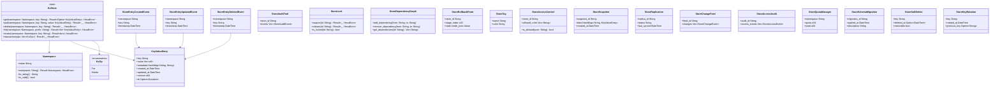
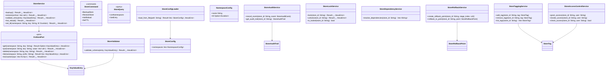
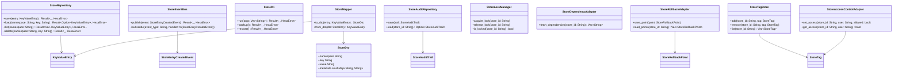

<!--
SPDX-FileCopyrightText: 2025 Husamettin ARABACI
SPDX-License-Identifier: MIT
-->

# Store Module (HexaStore)

## Domain Layer

```mermaid
classDiagram
    class KvStore {
        <<trait>>
        +get(namespace: Namespace, key: String) Result~Option~KeyValueEntry~, HexaError~
        +put(namespace: Namespace, key: String, value: KeyValueEntry) Result~ _ , HexaError~
        +delete(namespace: Namespace, key: String) Result~ _ , HexaError~
        +list(namespace: Namespace, prefix: String) Result~Vec~KeyValueEntry~, HexaError~
        +exists(namespace: Namespace, key: String) Result~bool, HexaError~
        +transaction(ops: Vec~KvOp~) Result~_, HexaError~
    }
    class Namespace {
        +value String
        +new(name: String) Result~Namespace, HexaError~
        +to_string() String
        +is_valid() bool
    }
    class KeyValueEntry {
        +key String
        +value Vec~u8~
        +metadata HashMap~String, String~
        +created_at DateTime
        +updated_at DateTime
        +version u64
        +ttl Option~Duration~
    }
    class KvOp {
        <<enumeration>>
        Put
        Delete
    }
    class StoreEntryCreatedEvent {
        +namespace String
        +key String
        +timestamp DateTime
    }
    class StoreEntryUpdatedEvent {
        +namespace String
        +key String
        +timestamp DateTime
    }
    class StoreEntryDeletedEvent {
        +namespace String
        +key String
        +timestamp DateTime
    }
    class StoreAuditTrail {
        +store_id String
        +events Vec~StoreAuditEvent~
    }
    class StoreLock {
        +acquire(id: String) Result~_, HexaError~
        +release(id: String) Result~_, HexaError~
        +is_locked(id: String) bool
    }
    class StoreDependencyGraph {
        +add_dependency(from: String, to: String)
        +remove_dependency(from: String, to: String)
        +get_dependencies(id: String) Vec~String~
    }
    class StoreRollbackPoint {
        +store_id String
        +stage_index u32
        +state serde_json::Value
    }
    class StoreTag {
        +name String
        +color String
    }
    class StoreAccessControl {
        +store_id String
        +allowed_roles Vec~String~
        +is_allowed(user: String) bool
    }
    class StoreSnapshot {
        +snapshot_id String
        +data HashMap~String, KeyValueEntry~
        +created_at DateTime
    }
    class StoreReplication {
        +replica_id String
        +status String
        +last_synced DateTime
    }
    class StoreChangeFeed {
        +feed_id String
        +changes Vec~StoreChangeEvent~
    }
    class StoreAccessAudit {
        +audit_id String
        +access_events Vec~StoreAccessEvent~
    }
    class StoreQuotaManager {
        +namespace String
        +quota u64
        +used u64
    }
    class StoreSchemaMigration {
        +migration_id String
        +applied_at DateTime
        +description String
    }
    class StoreSoftDelete {
        +key String
        +deleted_at Option~DateTime~
        +restorable bool
    }
    class StoreKeyRotation {
        +key String
        +rotated_at DateTime
        +previous_key Option~String~
    }
    KvStore --> Namespace
    KvStore --> KeyValueEntry
    KvStore --> KvOp
    StoreEntryCreatedEvent --> KeyValueEntry
    StoreEntryUpdatedEvent --> KeyValueEntry
    StoreEntryDeletedEvent --> KeyValueEntry
```

## Application Layer

```mermaid
classDiagram
    class KvStorePort {
        <<port>>
        +get(namespace: String, key: String) Result~Option~KeyValueEntry~, HexaError~
        +put(namespace: String, key: String, value: Vec~u8~) Result~_, HexaError~
        +delete(namespace: String, key: String) Result~_, HexaError~
        +list(namespace: String, prefix: String) Result~Vec~KeyValueEntry~, HexaError~
        +transaction(ops: Vec~KvOp~) Result~_, HexaError~
    }
    class StoreService {
        +backup() Result~_, HexaError~
        +restore(archive: Vec~u8~) Result~_, HexaError~
        +validate_entry(entry: KeyValueEntry) Result~_, HexaError~
        +hot_reload() Result~_, HexaError~
        +set_ttl(namespace: String, key: String, ttl: Duration) Result~_, HexaError~
    }
    class StoreCommand {
        <<command>>
        +BackupStore
        +RestoreStore
        +HotReload
        +SetTTL
    }
    class StoreQuery {
        <<query>>
        +ListNamespaces
        +GetEntry
    }
    class StoreValidator {
        +validate_schema(entry: KeyValueEntry) Result~_, HexaError~
    }
    class StoreConfigLoader {
        +load_from_file(path: String) Result~Vec~StoreConfig~, HexaError~
    }
    class StoreConfig {
        +namespaces Vec~NamespaceConfig~
    }
    class NamespaceConfig {
        +name String
        +ttl Option~Duration~
    }
    class StoreAuditService {
        +record_event(store_id: String, event: StoreAuditEvent)
        +get_audit_trail(store_id: String) StoreAuditTrail
    }
    class StoreLockService {
        +lock(store_id: String) Result~_, HexaError~
        +unlock(store_id: String) Result~_, HexaError~
        +is_locked(store_id: String) bool
    }
    class StoreDependencyService {
        +resolve_dependencies(store_id: String) Vec~String~
    }
    class StoreRollbackService {
        +create_rollback_point(store_id: String, stage_index: u32)
        +rollback_to_point(store_id: String, point: StoreRollbackPoint)
    }
    class StoreTaggingService {
        +add_tag(store_id: String, tag: StoreTag)
        +remove_tag(store_id: String, tag: StoreTag)
        +list_tags(store_id: String) Vec~StoreTag~
    }
    class StoreAccessControlService {
        +grant_access(store_id: String, user: String)
        +revoke_access(store_id: String, user: String)
        +check_access(store_id: String, user: String) bool
    }
    KvStorePort --> KeyValueEntry
    StoreService --> KvStorePort
    StoreConfigLoader --> StoreConfig
    StoreValidator --> KeyValueEntry
    StoreAuditService --> StoreAuditTrail
    StoreRollbackService --> StoreRollbackPoint
    StoreTaggingService --> StoreTag
    StoreAccessControlService --> StoreTag
```

## Infrastructure Layer

```mermaid
classDiagram
    class StoreRepository {
        +save(entry: KeyValueEntry) Result~_, HexaError~
        +load(namespace: String, key: String) Result~Option~KeyValueEntry~, HexaError~
        +list(namespace: String) Result~Vec~KeyValueEntry~, HexaError~
        +delete(namespace: String, key: String) Result~_, HexaError~
    }
    class StoreEventBus {
        +publish(event: StoreEntryCreatedEvent) Result~_, HexaError~
        +subscribe(event_type: String, handler: fn(StoreEntryCreatedEvent))
    }
    class StoreCli {
        +run(args: Vec~String~) Result~_, HexaError~
        +backup() Result~_, HexaError~
        +restore() Result~_, HexaError~
    }
    class StoreDto {
        +namespace String
        +key String
        +value String
        +metadata HashMap~String, String~
    }
    class StoreMapper {
        +to_dto(entry: KeyValueEntry) StoreDto
        +from_dto(dto: StoreDto) KeyValueEntry
    }
    class StoreAuditRepository {
        +save(trail: StoreAuditTrail)
        +load(store_id: String) Option~StoreAuditTrail~
    }
    class StoreLockManager {
        +acquire_lock(store_id: String)
        +release_lock(store_id: String)
        +is_locked(store_id: String) bool
    }
    class StoreDependencyAdapter {
        +fetch_dependencies(store_id: String) Vec~String~
    }
    class StoreRollbackAdapter {
        +save_point(point: StoreRollbackPoint)
        +load_points(store_id: String) Vec~StoreRollbackPoint~
    }
    class StoreTagStore {
        +add(store_id: String, tag: StoreTag)
        +remove(store_id: String, tag: StoreTag)
        +list(store_id: String) Vec~StoreTag~
    }
    class StoreAccessControlAdapter {
        +set_access(store_id: String, user: String, allowed: bool)
        +get_access(store_id: String, user: String) bool
    }
    StoreRepository --> KeyValueEntry
    StoreEventBus --> StoreEntryCreatedEvent
    StoreMapper --> StoreDto
    StoreMapper --> KeyValueEntry
    StoreAuditRepository --> StoreAuditTrail
    StoreRollbackAdapter --> StoreRollbackPoint
    StoreTagStore --> StoreTag
    StoreAccessControlAdapter --> StoreTag
```
