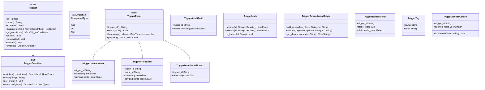
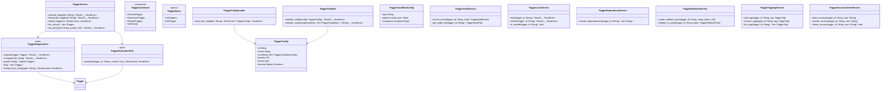
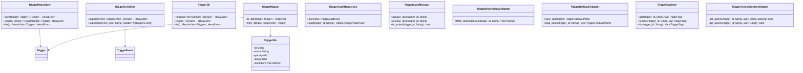

<!--
SPDX-FileCopyrightText: 2025 Husamettin ARABACI
SPDX-License-Identifier: MIT
-->

# Trigger Module (HexaTrigger)

## Domain Layer

```mermaid
classDiagram
    class Trigger {
        <<trait>>
        +id() String
        +name() String
        +is_active() bool
        +evaluate(context: Any) Result~bool, HexaError~
        +get_conditions() Vec~TriggerCondition~
        +priority() u32
        +deactivate() void
        +activate() void
        +timeout() Option~Duration~
    }
    class TriggerCondition {
        <<trait>>
        +matches(context: Any) Result~bool, HexaError~
        +description() String
        +get_priority() u32
        +compound_type() Option~CompoundType~
    }
    class CompoundType {
        <<enumeration>>
        And
        Or
        Not
    }
    class TriggerEvent {
        <<trait>>
        +trigger_id() String
        +event_type() &'static str
        +timestamp() chrono::DateTime~chrono::Utc~
        +payload() serde_json::Value
    }
    class TriggerCreatedEvent {
        +trigger_id String
        +timestamp DateTime
        +payload serde_json::Value
    }
    class TriggerFiredEvent {
        +trigger_id String
        +event_id String
        +timestamp DateTime
        +payload serde_json::Value
    }
    class TriggerDeactivatedEvent {
        +trigger_id String
        +timestamp DateTime
    }
    class TriggerAuditTrail {
        +trigger_id String
        +events Vec~TriggerAuditEvent~
    }
    class TriggerLock {
        +acquire(id: String) Result~_, HexaError~
        +release(id: String) Result~_, HexaError~
        +is_locked(id: String) bool
    }
    class TriggerDependencyGraph {
        +add_dependency(from: String, to: String)
        +remove_dependency(from: String, to: String)
        +get_dependencies(id: String) Vec~String~
    }
    class TriggerRollbackPoint {
        +trigger_id String
        +stage_index u32
        +state serde_json::Value
    }
    class TriggerTag {
        +name String
        +color String
    }
    class TriggerAccessControl {
        +trigger_id String
        +allowed_roles Vec~String~
        +is_allowed(user: String) bool
    }
    Trigger --> TriggerCondition
    TriggerEvent <|-- TriggerCreatedEvent
    TriggerEvent <|-- TriggerFiredEvent
    TriggerEvent <|-- TriggerDeactivatedEvent
```

## Application Layer

```mermaid
classDiagram
    class TriggerRegistryPort {
        <<port>>
        +register(trigger: Trigger) Result~_, HexaError~
        +unregister(id: String) Result~_, HexaError~
        +get(id: String) Option~Trigger~
        +list() Vec~Trigger~
        +reload_from_config(path: String) Result~usize, HexaError~
    }
    class TriggerEvaluationPort {
        <<port>>
        +evaluate(trigger_id: String, context: Any) Result~bool, HexaError~
    }
    class TriggerService {
        +activate_trigger(id: String) Result~_, HexaError~
        +deactivate_trigger(id: String) Result~_, HexaError~
        +reload_triggers() Result~usize, HexaError~
        +list_active() Vec~Trigger~
        +set_priority(id: String, priority: u32) Result~_, HexaError~
    }
    class TriggerCommand {
        <<command>>
        +ActivateTrigger
        +DeactivateTrigger
        +ReloadTriggers
        +SetPriority
    }
    class TriggerQuery {
        <<query>>
        +ListTriggers
        +GetTrigger
    }
    class TriggerValidator {
        +validate_config(config: TriggerConfig) Result~_, HexaError~
        +validate_compound(conditions: Vec~TriggerCondition~) Result~_, HexaError~
    }
    class TriggerConfigLoader {
        +load_from_file(path: String) Result~Vec~TriggerConfig~, HexaError~
    }
    class TriggerConfig {
        +id String
        +name String
        +conditions Vec~TriggerConditionConfig~
        +priority u32
        +active bool
        +timeout Option~Duration~
    }
    class TriggerConditionConfig {
        +type String
        +params serde_json::Value
        +compound CompoundType
    }
    class TriggerAuditService {
        +record_event(trigger_id: String, event: TriggerAuditEvent)
        +get_audit_trail(trigger_id: String) TriggerAuditTrail
    }
    class TriggerLockService {
        +lock(trigger_id: String) Result~_, HexaError~
        +unlock(trigger_id: String) Result~_, HexaError~
        +is_locked(trigger_id: String) bool
    }
    class TriggerDependencyService {
        +resolve_dependencies(trigger_id: String) Vec~String~
    }
    class TriggerRollbackService {
        +create_rollback_point(trigger_id: String, stage_index: u32)
        +rollback_to_point(trigger_id: String, point: TriggerRollbackPoint)
    }
    class TriggerTaggingService {
        +add_tag(trigger_id: String, tag: TriggerTag)
        +remove_tag(trigger_id: String, tag: TriggerTag)
        +list_tags(trigger_id: String) Vec~TriggerTag~
    }
    class TriggerAccessControlService {
        +grant_access(trigger_id: String, user: String)
        +revoke_access(trigger_id: String, user: String)
        +check_access(trigger_id: String, user: String) bool
    }
    TriggerRegistryPort --> Trigger
    TriggerEvaluationPort --> Trigger
    TriggerService --> TriggerRegistryPort
    TriggerService --> TriggerEvaluationPort
    TriggerConfigLoader --> TriggerConfig
    TriggerValidator --> TriggerConfig
```

## Infrastructure Layer

```mermaid
classDiagram
    class TriggerRepository {
        +save(trigger: Trigger) Result~_, HexaError~
        +load(id: String) Result~Option~Trigger~, HexaError~
        +list() Result~Vec~Trigger~, HexaError~
    }
    class TriggerEventBus {
        +publish(event: TriggerEvent) Result~_, HexaError~
        +subscribe(event_type: String, handler: fn(TriggerEvent))
    }
    class TriggerCli {
        +run(args: Vec~String~) Result~_, HexaError~
        +reload() Result~_, HexaError~
        +list() Result~Vec~Trigger~, HexaError~
    }
    class TriggerDto {
        +id String
        +name String
        +priority u32
        +active bool
        +conditions Vec~String~
    }
    class TriggerMapper {
        +to_dto(trigger: Trigger) TriggerDto
        +from_dto(dto: TriggerDto) Trigger
    }
    class TriggerAuditRepository {
        +save(trail: TriggerAuditTrail)
        +load(trigger_id: String) Option~TriggerAuditTrail~
    }
    class TriggerLockManager {
        +acquire_lock(trigger_id: String)
        +release_lock(trigger_id: String)
        +is_locked(trigger_id: String) bool
    }
    class TriggerDependencyAdapter {
        +fetch_dependencies(trigger_id: String) Vec~String~
    }
    class TriggerRollbackAdapter {
        +save_point(point: TriggerRollbackPoint)
        +load_points(trigger_id: String) Vec~TriggerRollbackPoint~
    }
    class TriggerTagStore {
        +add(trigger_id: String, tag: TriggerTag)
        +remove(trigger_id: String, tag: TriggerTag)
        +list(trigger_id: String) Vec~TriggerTag~
    }
    class TriggerAccessControlAdapter {
        +set_access(trigger_id: String, user: String, allowed: bool)
        +get_access(trigger_id: String, user: String) bool
    }
    TriggerRepository --> Trigger
    TriggerEventBus --> TriggerEvent
    TriggerMapper --> TriggerDto
    TriggerMapper --> Trigger
```
