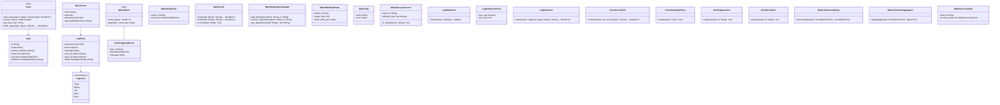
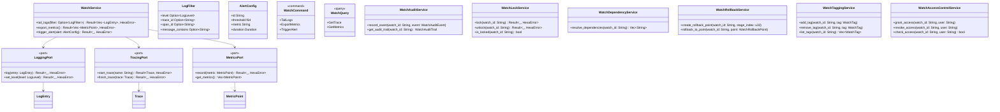
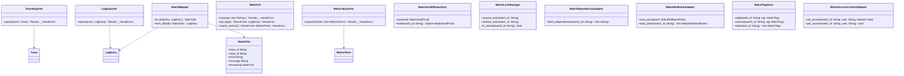

<!--
SPDX-FileCopyrightText: 2025 Husamettin ARABACI
SPDX-License-Identifier: MIT
-->

# Watch Module (HexaWatch)

## Domain Layer

```mermaid
classDiagram
    class Trace {
        <<trait>>
        +start_span(name: String) Result~Span, HexaError~
        +current_span() Option~Span~
        +get_trace_id() String
        +finish_span(span: Span) Result~ _ , HexaError~
    }
    class Span {
        +id String
        +name String
        +parent_id Option~String~
        +start_time DateTime
        +end_time Option~DateTime~
        +attributes HashMap~String, String~
    }
    class LogEntry {
        +timestamp DateTime
        +level LogLevel
        +message String
        +trace_id Option~String~
        +span_id Option~String~
        +fields HashMap~String, String~
    }
    class LogLevel {
        <<enumeration>>
        Trace
        Debug
        Info
        Warn
        Error
    }
    class MetricPoint {
        +name String
        +value f64
        +timestamp DateTime
        +tags HashMap~String, String~
    }
    class WatchEvent {
        <<trait>>
        +event_type() &'static str
        +payload() serde_json::Value
    }
    class AlertTriggeredEvent {
        +alert_id String
        +timestamp DateTime
        +message String
    }
    %% Additional missing domain structures from output.txt
    class WatchAuditTrail {
        +watch_id String
        +events Vec~WatchAuditEvent~
    }
    class WatchLock {
        +acquire(id: String) Result~_, HexaError~
        +release(id: String) Result~_, HexaError~
        +is_locked(id: String) bool
    }
    class WatchDependencyGraph {
        +add_dependency(from: String, to: String)
        +remove_dependency(from: String, to: String)
        +get_dependencies(id: String) Vec~String~
    }
    class WatchRollbackPoint {
        +watch_id String
        +stage_index u32
        +state serde_json::Value
    }
    class WatchTag {
        +name String
        +color String
    }
    class WatchAccessControl {
        +watch_id String
        +allowed_roles Vec~String~
        +is_allowed(user: String) bool
    }
    class LogRedaction {
        +redact(entry: LogEntry) LogEntry
    }
    class LogRetentionPolicy {
        +max_age Duration
        +max_size u64
    }
    class LogExporters {
        +export(entry: LogEntry, target: String) Result~_, HexaError~
    }
    class TraceCorrelation {
        +correlate(trace_ids: Vec~String~) Result~_, HexaError~
    }
    class TraceSamplingPolicy {
        +sample(trace: Trace) bool
    }
    class AlertSuppression {
        +suppress(alert_id: String) bool
    }
    class AlertEscalation {
        +escalate(alert_id: String) void
    }
    class MetricsDownsampling {
        +downsample(points: Vec~MetricPoint~) Vec~MetricPoint~
    }
    class MetricsCustomAggregator {
        +aggregate(points: Vec~MetricPoint~) MetricPoint
    }
    class WatchAccessAudit {
        +audit_id String
        +access_events Vec~WatchAccessEvent~
    }
    Trace --> Span
    LogEntry --> LogLevel
    MetricPoint --> LogEntry
    WatchEvent <|-- AlertTriggeredEvent
```

## Application Layer

```mermaid
classDiagram
    class LoggingPort {
        <<port>>
        +log(entry: LogEntry) Result~_, HexaError~
        +set_level(level: LogLevel) Result~_, HexaError~
    }
    class TracingPort {
        <<port>>
        +start_trace(name: String) Result~Trace, HexaError~
        +finish_trace(trace: Trace) Result~_, HexaError~
    }
    class MetricsPort {
        <<port>>
        +record(metric: MetricPoint) Result~_, HexaError~
        +get_metrics() Vec~MetricPoint~
    }
    class WatchService {
        +tail_logs(filter: Option~LogFilter~) Result~Vec~LogEntry~, HexaError~
        +export_metrics() Result~Vec~MetricPoint~, HexaError~
        +trigger_alert(alert: AlertConfig) Result~_, HexaError~
    }
    class LogFilter {
        +level Option~LogLevel~
        +trace_id Option~String~
        +span_id Option~String~
        +message_contains Option~String~
    }
    class AlertConfig {
        +id String
        +threshold f64
        +metric String
        +duration Duration
    }
    class WatchCommand {
        <<command>>
        +TailLogs
        +ExportMetrics
        +TriggerAlert
    }
    class WatchQuery {
        <<query>>
        +GetTrace
        +GetMetrics
    }
    %% Additional missing application structures from output.txt
    class WatchAuditService {
        +record_event(watch_id: String, event: WatchAuditEvent)
        +get_audit_trail(watch_id: String) WatchAuditTrail
    }
    class WatchLockService {
        +lock(watch_id: String) Result~_, HexaError~
        +unlock(watch_id: String) Result~_, HexaError~
        +is_locked(watch_id: String) bool
    }
    class WatchDependencyService {
        +resolve_dependencies(watch_id: String) Vec~String~
    }
    class WatchRollbackService {
        +create_rollback_point(watch_id: String, stage_index: u32)
        +rollback_to_point(watch_id: String, point: WatchRollbackPoint)
    }
    class WatchTaggingService {
        +add_tag(watch_id: String, tag: WatchTag)
        +remove_tag(watch_id: String, tag: WatchTag)
        +list_tags(watch_id: String) Vec~WatchTag~
    }
    class WatchAccessControlService {
        +grant_access(watch_id: String, user: String)
        +revoke_access(watch_id: String, user: String)
        +check_access(watch_id: String, user: String) bool
    }
    LoggingPort --> LogEntry
    TracingPort --> Trace
    MetricsPort --> MetricPoint
    WatchService --> LoggingPort
    WatchService --> TracingPort
    WatchService --> MetricsPort
```

## Infrastructure Layer

```mermaid
classDiagram
    class LogExporter {
        +export(entry: LogEntry) Result~_, HexaError~
    }
    class TraceExporter {
        +export(trace: Trace) Result~_, HexaError~
    }
    class MetricsExporter {
        +export(metrics: Vec~MetricPoint~) Result~_, HexaError~
    }
    class WatchCli {
        +run(args: Vec~String~) Result~_, HexaError~
        +tail_logs() Result~Vec~LogEntry~, HexaError~
        +export_metrics() Result~Vec~MetricPoint~, HexaError~
    }
    class WatchDto {
        +trace_id String
        +span_id String
        +level String
        +message String
        +timestamp DateTime
    }
    class WatchMapper {
        +to_dto(entry: LogEntry) WatchDto
        +from_dto(dto: WatchDto) LogEntry
    }
    %% Additional missing infrastructure structures from output.txt
    class WatchAuditRepository {
        +save(trail: WatchAuditTrail)
        +load(watch_id: String) Option~WatchAuditTrail~
    }
    class WatchLockManager {
        +acquire_lock(watch_id: String)
        +release_lock(watch_id: String)
        +is_locked(watch_id: String) bool
    }
    class WatchDependencyAdapter {
        +fetch_dependencies(watch_id: String) Vec~String~
    }
    class WatchRollbackAdapter {
        +save_point(point: WatchRollbackPoint)
        +load_points(watch_id: String) Vec~WatchRollbackPoint~
    }
    class WatchTagStore {
        +add(watch_id: String, tag: WatchTag)
        +remove(watch_id: String, tag: WatchTag)
        +list(watch_id: String) Vec~WatchTag~
    }
    class WatchAccessControlAdapter {
        +set_access(watch_id: String, user: String, allowed: bool)
        +get_access(watch_id: String, user: String) bool
    }
    LogExporter --> LogEntry
    TraceExporter --> Trace
    MetricsExporter --> MetricPoint
    WatchMapper --> WatchDto
    WatchMapper --> LogEntry
```
