<!--
SPDX-FileCopyrightText: 2025 Husamettin ARABACI
SPDX-License-Identifier: MIT
-->

# 🏛️ Hexagonal Architecture Guide

This document provides a comprehensive, language-agnostic guide to implementing **Hexagonal Architecture (Ports & Adapters)** combined with **Domain-Driven Design (DDD)** principles in the hexaFn project.

---

## 🎯 **Architecture Philosophy**

hexaFn implements Clean Architecture through a hexagonal structure where business logic remains completely isolated from external concerns through well-defined contracts (ports) and implementations (adapters).

### **Core Principles**

- 🔵 **Domain-First**: Business logic drives all architectural decisions
- 🔌 **Ports & Adapters**: Clean separation between core and infrastructure
- 🧩 **Protocol Agnostic**: HTTP, gRPC, WebSocket, CLI - all treated equally
- 📨 **Event-Driven**: Cross-domain communication via domain events
- 🔄 **Testable**: Each layer independently testable without external dependencies

---

## 🏗️ **Request Processing Flow**

### **Complete Data Journey: Inbound → Core → Outbound**

```mermaid
graph TB
    %% External World
    subgraph "External Systems"
        HTTP[HTTP Client]
        GRPC[gRPC Client]
        CLI[CLI Tool]
        Queue[Message Queue]
    end
    
    %% Primary Adapters (Inbound)
    subgraph "Primary Adapters (Infrastructure Layer)"
        Controller[Protocol Controller]
        Adapter[Request Adapter]
        Mapper1[DTO → Command Mapper]
    end
    
    %% Application Ports
    subgraph "Application Boundary"
        InputPort[Input Port Interface]
        OutputPort[Output Port Interface]
    end
    
    %% Application Core
    subgraph "Application Layer"
        Service[Application Service]
        Command[Command/Query Objects]
        Validation[Input Validation]
    end
    
    %% Domain Core
    subgraph "Domain Layer"
        Entity[Domain Entity]
        ValueObj[Value Objects]
        DomainService[Domain Services]
        DomainEvent[Domain Events]
        BusinessRules[Business Validation]
    end
    
    %% Secondary Adapters (Outbound)
    subgraph "Secondary Adapters (Infrastructure Layer)"
        RepoAdapter[Repository Adapter]
        EventAdapter[Event Bus Adapter]
        ApiAdapter[External API Adapter]
        Mapper2[Entity → Record Mapper]
    end
    
    %% External Dependencies
    subgraph "External Dependencies"
        Database[(Database)]
        MessageBus[Message Bus]
        ExternalAPI[External APIs]
    end
    
    %% Flow connections
    HTTP --> Controller
    GRPC --> Controller
    CLI --> Controller
    Queue --> Controller
    
    Controller --> Adapter
    Adapter --> Mapper1
    Mapper1 --> InputPort
    
    InputPort --> Service
    Service --> Command
    Service --> Validation
    Service --> Entity
    
    Entity --> ValueObj
    Entity --> DomainService
    Entity --> BusinessRules
    Entity --> DomainEvent
    
    Service --> OutputPort
    OutputPort --> RepoAdapter
    OutputPort --> EventAdapter
    OutputPort --> ApiAdapter
    
    RepoAdapter --> Mapper2
    Mapper2 --> Database
    EventAdapter --> MessageBus
    ApiAdapter --> ExternalAPI
```



---

## 📋 **Step-by-Step Process Flow**

### **🔵 Phase 1: Request Reception (Primary Adapters)**

#### **Step 1: Protocol Controller**

- **Location**: `src/infrastructure/adapters/inbound/`
- **Subfolders**:
  - `src/infrastructure/adapters/inbound/http/` - REST controllers
  - `src/infrastructure/adapters/inbound/grpc/` - gRPC service implementations
  - `src/infrastructure/adapters/inbound/cli/` - CLI command handlers
  - `src/infrastructure/adapters/inbound/queue/` - Message queue consumers
- **Responsibility**: Handle protocol-specific concerns (HTTP headers, gRPC metadata, CLI arguments)
- **Technology Examples**: REST Controller, gRPC Service, CLI Command Handler
- **Key Actions**:
  - Receive external request
  - Extract authentication/authorization data
  - Handle protocol-specific errors
  - Route to appropriate adapter

#### **Step 2: Request Adapter**

- **Location**: `src/infrastructure/adapters/inbound/`
- **Subfolders**:
  - `src/infrastructure/adapters/inbound/http/adapters/` - HTTP request adapters
  - `src/infrastructure/adapters/inbound/grpc/adapters/` - gRPC request adapters
  - `src/infrastructure/adapters/inbound/cli/adapters/` - CLI request adapters
  - `src/infrastructure/adapters/inbound/queue/adapters/` - Queue message adapters
- **Responsibility**: Transform external format to internal format
- **Key Actions**:
  - Parse request payload
  - Validate request structure
  - Handle serialization/deserialization
  - Apply protocol-agnostic transformations

#### **Step 3: DTO → Command Mapping**

- **Location**: `src/infrastructure/mappers/inbound/`
- **Subfolders**:
  - `src/infrastructure/mappers/inbound/dto_to_command/` - External DTO to command mappers
  - `src/infrastructure/mappers/inbound/request_to_dto/` - Raw request to DTO mappers
  - `src/infrastructure/dtos/inbound/` - External facing DTOs
- **Files Examples**:
  - `src/infrastructure/dtos/inbound/http_dtos.rs` - HTTP request/response DTOs
  - `src/infrastructure/dtos/inbound/grpc_dtos.rs` - gRPC message DTOs
  - `src/infrastructure/mappers/inbound/trigger_mappers.rs` - Trigger-specific mappers
- **Responsibility**: Convert external DTOs to application commands
- **Key Actions**:
  - Map external field names to internal names
  - Apply default values
  - Handle optional/required field logic
  - Create typed command objects

---

### **🟡 Phase 2: Application Boundary (Ports)**

#### **Step 4: Input Port Interface**

- **Location**: `src/application/ports/inbound/`
- **Subfolders**:
  - `src/application/ports/inbound/triggers/` - Trigger-specific port interfaces
  - `src/application/ports/inbound/commands/` - Command handling port interfaces
  - `src/application/ports/inbound/queries/` - Query handling port interfaces
- **Files Examples**:
  - `src/application/ports/inbound/triggers/trigger_port.rs` - Trigger operations interface
  - `src/application/ports/inbound/commands/command_port.rs` - Command execution interface
  - `src/application/ports/inbound/queries/query_port.rs` - Query execution interface
- **Responsibility**: Define contract between infrastructure and application
- **Key Actions**:
  - Expose application capabilities
  - Define method signatures
  - Specify return types and error handling
  - Maintain stable API for external adapters

---

### **🟢 Phase 3: Application Processing (Core Logic)**

#### **Step 5: Application Service**

- **Location**: `src/application/services/`
- **Subfolders**:
  - `src/application/services/triggers/` - Trigger-specific service implementations
  - `src/application/services/commands/` - Command handling services
  - `src/application/services/queries/` - Query handling services
  - `src/application/services/shared/` - Shared service utilities
- **Files Examples**:
  - `src/application/services/triggers/trigger_service.rs` - Trigger orchestration service
  - `src/application/services/commands/command_handler.rs` - Command processing service
  - `src/application/services/queries/query_handler.rs` - Query processing service
- **Responsibility**: Orchestrate use case execution
- **Key Actions**:
  - Coordinate between domain objects
  - Handle transaction boundaries
  - Manage cross-cutting concerns
  - Implement application-specific logic

#### **Step 6: Command/Query Processing**

- **Location**: `src/application/models/`
- **Subfolders**:
  - `src/application/models/commands/` - Command data structures
  - `src/application/models/queries/` - Query data structures
  - `src/application/models/results/` - Result data structures
  - `src/application/models/events/` - Application event structures
- **Files Examples**:
  - `src/application/models/commands/trigger_command.rs` - Trigger command definitions
  - `src/application/models/queries/trigger_query.rs` - Trigger query definitions
  - `src/application/models/results/trigger_result.rs` - Trigger result structures
- **Responsibility**: Represent application intentions
- **Key Actions**:
  - Carry use case data
  - Validate application-level constraints
  - Provide immutable data structures
  - Enable CQRS patterns

#### **Step 7: Input Validation**

- **Location**: `src/application/validators/`
- **Subfolders**:
  - `src/application/validators/commands/` - Command validation logic
  - `src/application/validators/queries/` - Query validation logic
  - `src/application/validators/authorization/` - Authorization validators
  - `src/application/validators/business/` - Business rule validators
- **Files Examples**:
  - `src/application/validators/commands/trigger_command_validator.rs` - Trigger command validation
  - `src/application/validators/authorization/access_validator.rs` - Access control validation
  - `src/application/validators/business/business_rule_validator.rs` - Business constraint validation
- **Responsibility**: Validate application-level business rules
- **Key Actions**:
  - Check authorization rules
  - Validate business constraints
  - Ensure data consistency
  - Apply application policies

---

### **🟢 Phase 4: Domain Processing (Business Logic)**

#### **Step 8: Domain Entity Creation/Retrieval**

- **Location**: `src/domain/entities/`
- **Subfolders**:
  - `src/domain/entities/triggers/` - Trigger-related entities
  - `src/domain/entities/shared/` - Shared domain entities
  - `src/domain/entities/aggregates/` - Aggregate root entities
- **Files Examples**:
  - `src/domain/entities/triggers/trigger.rs` - Trigger domain entity
  - `src/domain/entities/triggers/trigger_execution.rs` - Trigger execution entity
  - `src/domain/entities/shared/identifier.rs` - Shared identifier entity
- **Responsibility**: Represent business concepts with behavior
- **Key Actions**:
  - Enforce invariants
  - Encapsulate business logic
  - Manage entity lifecycle
  - Generate domain events

#### **Step 9: Value Object Processing**

- **Location**: `src/domain/value_objects/`
- **Subfolders**:
  - `src/domain/value_objects/triggers/` - Trigger-specific value objects
  - `src/domain/value_objects/shared/` - Shared value objects
  - `src/domain/value_objects/primitives/` - Primitive value object wrappers
- **Files Examples**:
  - `src/domain/value_objects/triggers/trigger_name.rs` - Trigger name value object
  - `src/domain/value_objects/triggers/trigger_config.rs` - Trigger configuration
  - `src/domain/value_objects/shared/timestamp.rs` - Timestamp value object
  - `src/domain/value_objects/primitives/email.rs` - Email value object
- **Responsibility**: Represent immutable business values
- **Key Actions**:
  - Ensure value validity
  - Provide rich domain behavior
  - Maintain immutability
  - Enable complex comparisons

#### **Step 10: Business Validation**

- **Location**: `src/domain/validators/`
- **Subfolders**:
  - `src/domain/validators/triggers/` - Trigger-specific domain validation
  - `src/domain/validators/business_rules/` - Core business rule validators
  - `src/domain/validators/invariants/` - Domain invariant validators
- **Files Examples**:
  - `src/domain/validators/triggers/trigger_validator.rs` - Trigger domain validation
  - `src/domain/validators/business_rules/execution_rules.rs` - Execution business rules
  - `src/domain/validators/invariants/entity_invariants.rs` - Entity invariant validation
- **Responsibility**: Enforce core business rules
- **Key Actions**:
  - Validate domain invariants
  - Check business constraints
  - Ensure data integrity
  - Apply domain policies

#### **Step 11: Domain Service Processing**

- **Location**: `src/domain/services/`
- **Subfolders**:
  - `src/domain/services/triggers/` - Trigger-specific domain services
  - `src/domain/services/execution/` - Execution domain services
  - `src/domain/services/coordination/` - Cross-entity coordination services
- **Files Examples**:
  - `src/domain/services/triggers/trigger_manager.rs` - Trigger management service
  - `src/domain/services/execution/execution_engine.rs` - Execution coordination service
  - `src/domain/services/coordination/entity_coordinator.rs` - Multi-entity coordination
- **Responsibility**: Handle complex business operations
- **Key Actions**:
  - Coordinate between multiple entities
  - Implement complex business algorithms
  - Maintain domain model consistency
  - Provide stateless business operations

#### **Step 12: Domain Event Generation**

- **Location**: `src/domain/events/`
- **Subfolders**:
  - `src/domain/events/triggers/` - Trigger-related domain events
  - `src/domain/events/execution/` - Execution-related domain events
  - `src/domain/events/shared/` - Shared domain events
- **Files Examples**:
  - `src/domain/events/triggers/trigger_created.rs` - Trigger creation event
  - `src/domain/events/triggers/trigger_updated.rs` - Trigger update event
  - `src/domain/events/execution/execution_started.rs` - Execution start event
  - `src/domain/events/execution/execution_completed.rs` - Execution completion event
- **Responsibility**: Signal important business occurrences
- **Key Actions**:
  - Capture business-significant events
  - Enable loose coupling between domains
  - Support eventual consistency
  - Facilitate audit trails

---

### **🔴 Phase 5: Output Processing (Secondary Adapters)**

#### **Step 13: Output Port Interfaces**

- **Location**: `src/application/ports/outbound/`
- **Subfolders**:
  - `src/application/ports/outbound/persistence/` - Data persistence port interfaces
  - `src/application/ports/outbound/messaging/` - Event publishing port interfaces
  - `src/application/ports/outbound/external/` - External API port interfaces
  - `src/application/ports/outbound/notifications/` - Notification port interfaces
- **Files Examples**:
  - `src/application/ports/outbound/persistence/trigger_repository.rs` - Trigger persistence interface
  - `src/application/ports/outbound/messaging/event_publisher.rs` - Event publishing interface
  - `src/application/ports/outbound/external/external_api_client.rs` - External API interface
- **Responsibility**: Define contracts for external dependencies
- **Key Actions**:
  - Abstract persistence concerns
  - Define messaging contracts
  - Specify external API interfaces
  - Enable dependency inversion

#### **Step 14: Repository Adapter**

- **Location**: `src/infrastructure/adapters/outbound/persistence/`
- **Subfolders**:
  - `src/infrastructure/adapters/outbound/persistence/database/` - Database-specific adapters
  - `src/infrastructure/adapters/outbound/persistence/file_system/` - File system adapters
  - `src/infrastructure/adapters/outbound/persistence/cache/` - Cache adapters
- **Files Examples**:
  - `src/infrastructure/adapters/outbound/persistence/database/trigger_repository_impl.rs` - Database repository implementation
  - `src/infrastructure/adapters/outbound/persistence/cache/trigger_cache_adapter.rs` - Cache adapter implementation
- **Responsibility**: Handle data persistence
- **Key Actions**:
  - Implement persistence logic
  - Handle database transactions
  - Manage connection pooling
  - Provide data access optimization

#### **Step 15: Event Bus Adapter**

- **Location**: `src/infrastructure/adapters/outbound/messaging/`
- **Subfolders**:
  - `src/infrastructure/adapters/outbound/messaging/event_bus/` - Event bus adapters
  - `src/infrastructure/adapters/outbound/messaging/message_queue/` - Message queue adapters
  - `src/infrastructure/adapters/outbound/messaging/pub_sub/` - Pub/Sub adapters
- **Files Examples**:
  - `src/infrastructure/adapters/outbound/messaging/event_bus/event_publisher_impl.rs` - Event bus publisher
  - `src/infrastructure/adapters/outbound/messaging/message_queue/queue_adapter.rs` - Message queue adapter
- **Responsibility**: Publish domain events
- **Key Actions**:
  - Route events to appropriate channels
  - Handle message serialization
  - Ensure delivery guarantees
  - Manage event ordering

#### **Step 16: External API Adapter**

- **Location**: `src/infrastructure/adapters/outbound/external/`
- **Subfolders**:
  - `src/infrastructure/adapters/outbound/external/apis/` - External API client adapters
  - `src/infrastructure/adapters/outbound/external/webhooks/` - Webhook adapters
  - `src/infrastructure/adapters/outbound/external/notifications/` - Notification service adapters
- **Files Examples**:
  - `src/infrastructure/adapters/outbound/external/apis/third_party_api_client.rs` - Third-party API client
  - `src/infrastructure/adapters/outbound/external/webhooks/webhook_sender.rs` - Webhook sender adapter
  - `src/infrastructure/adapters/outbound/external/notifications/email_service.rs` - Email notification adapter
- **Responsibility**: Communicate with external systems
- **Key Actions**:
  - Handle external API protocols
  - Manage authentication/authorization
  - Implement retry logic
  - Handle external service failures

#### **Step 17: Entity → Record Mapping**

- **Location**: `src/infrastructure/mappers/outbound/`
- **Subfolders**:
  - `src/infrastructure/mappers/outbound/entity_to_record/` - Domain entity to database record mappers
  - `src/infrastructure/mappers/outbound/event_to_message/` - Domain event to message mappers
  - `src/infrastructure/mappers/outbound/dto_serializers/` - DTO serialization mappers
- **Files Examples**:
  - `src/infrastructure/mappers/outbound/entity_to_record/trigger_entity_mapper.rs` - Trigger entity to record mapper
  - `src/infrastructure/mappers/outbound/event_to_message/trigger_event_mapper.rs` - Trigger event to message mapper
  - `src/infrastructure/dtos/outbound/database_records.rs` - Database record DTOs
  - `src/infrastructure/dtos/outbound/message_payloads.rs` - Message payload DTOs
- **Responsibility**: Transform domain objects to persistence format
- **Key Actions**:
  - Map domain fields to storage fields
  - Handle data type conversions
  - Apply storage-specific transformations
  - Manage relationship mappings

---

## 📁 **Complete Folder Structure Summary**

### **📦 Infrastructure Layer (`src/infrastructure/`)**

```text
src/infrastructure/
├── adapters/
│   ├── inbound/                    # Primary Adapters (Entry Points)
│   │   ├── http/
│   │   │   ├── controllers/        # HTTP controllers
│   │   │   └── adapters/          # HTTP request adapters
│   │   ├── grpc/
│   │   │   ├── services/          # gRPC service implementations
│   │   │   └── adapters/          # gRPC request adapters
│   │   ├── cli/
│   │   │   ├── commands/          # CLI command handlers
│   │   │   └── adapters/          # CLI request adapters
│   │   └── queue/
│   │       ├── consumers/         # Message queue consumers
│   │       └── adapters/          # Queue message adapters
│   └── outbound/                   # Secondary Adapters (Exit Points)
│       ├── persistence/
│       │   ├── database/          # Database repository implementations
│       │   ├── file_system/       # File system adapters
│       │   └── cache/            # Cache adapters
│       ├── messaging/
│       │   ├── event_bus/        # Event bus publishers
│       │   ├── message_queue/    # Message queue adapters
│       │   └── pub_sub/          # Pub/Sub adapters
│       └── external/
│           ├── apis/             # External API clients
│           ├── webhooks/         # Webhook senders
│           └── notifications/    # Notification services
├── mappers/
│   ├── inbound/                    # Request Mapping
│   │   ├── dto_to_command/        # External DTO → Command mappers
│   │   └── request_to_dto/        # Raw request → DTO mappers
│   └── outbound/                   # Response Mapping
│       ├── entity_to_record/      # Domain entity → Database record
│       ├── event_to_message/      # Domain event → Message mappers
│       └── dto_serializers/       # DTO serialization mappers
└── dtos/
    ├── inbound/                    # External Facing DTOs
    │   ├── http_dtos.rs           # HTTP request/response DTOs
    │   └── grpc_dtos.rs           # gRPC message DTOs
    └── outbound/                   # Internal System DTOs
        ├── database_records.rs    # Database record DTOs
        └── message_payloads.rs    # Message payload DTOs
```

### **🏗️ Application Layer (`src/application/`)**

```text
src/application/
├── ports/
│   ├── inbound/                    # Input Port Interfaces
│   │   ├── triggers/              # Trigger-specific ports
│   │   ├── commands/              # Command handling ports
│   │   └── queries/               # Query handling ports
│   └── outbound/                   # Output Port Interfaces
│       ├── persistence/           # Data persistence ports
│       ├── messaging/             # Event publishing ports
│       ├── external/              # External API ports
│       └── notifications/         # Notification ports
├── services/
│   ├── triggers/                   # Trigger-specific services
│   ├── commands/                   # Command handling services
│   ├── queries/                    # Query handling services
│   └── shared/                     # Shared service utilities
├── models/
│   ├── commands/                   # Command data structures
│   ├── queries/                    # Query data structures
│   ├── results/                    # Result data structures
│   └── events/                     # Application event structures
└── validators/
    ├── commands/                   # Command validation logic
    ├── queries/                    # Query validation logic
    ├── authorization/              # Authorization validators
    └── business/                   # Business rule validators
```

### **🎯 Domain Layer (`src/domain/`)**

```text
src/domain/
├── entities/
│   ├── triggers/                   # Trigger-related entities
│   ├── shared/                     # Shared domain entities
│   └── aggregates/                 # Aggregate root entities
├── value_objects/
│   ├── triggers/                   # Trigger-specific value objects
│   ├── shared/                     # Shared value objects
│   └── primitives/                 # Primitive value object wrappers
├── services/
│   ├── triggers/                   # Trigger-specific domain services
│   ├── execution/                  # Execution domain services
│   └── coordination/               # Cross-entity coordination services
├── events/
│   ├── triggers/                   # Trigger-related domain events
│   ├── execution/                  # Execution-related domain events
│   └── shared/                     # Shared domain events
└── validators/
    ├── triggers/                   # Trigger-specific domain validation
    ├── business_rules/             # Core business rule validators
    └── invariants/                 # Domain invariant validators
```

### **🔧 Layer Communication Patterns**

| **From Layer** | **To Layer** | **Via** | **Example** |
|----------------|--------------|---------|-------------|
| Infrastructure (Inbound) → Application | Ports | `TriggerPort` interface | HTTP adapter calls trigger port |
| Application → Domain | Direct calls | Entity methods, Domain services | Service calls entity business logic |
| Application → Infrastructure (Outbound) | Ports | `TriggerRepository` interface | Service calls repository through port |
| Domain → Domain | Direct calls | Entity-to-entity, Value objects | Entity uses value objects internally |

---

## 🔄 **Response Flow (Outbound Journey)**

### **Return Path: Core → Infrastructure → Client**

```mermaid
graph TB
    %% Domain Results
    Entity[Domain Entity] --> Service[Application Service]
    DomainEvent[Domain Events] --> Service
    
    %% Application Response
    Service --> Result[Application Result]
    Result --> OutputAdapter[Response Adapter]
    
    %% Infrastructure Transformation
    OutputAdapter --> ResponseMapper[Result → DTO Mapper]
    ResponseMapper --> ProtocolFormatter[Protocol Formatter]
    
    %% Client Response
    ProtocolFormatter --> HTTPResponse[HTTP Response]
    ProtocolFormatter --> GRPCResponse[gRPC Response]
    ProtocolFormatter --> CLIOutput[CLI Output]
```



---

## 📊 **Layer Responsibilities Matrix**

| Layer | Input Processing | Core Processing | Output Processing |
|-------|-----------------|-----------------|-------------------|
| **Infrastructure** | Protocol handling, DTO mapping | ❌ No business logic | Data persistence, Event publishing |
| **Application** | Command validation, Authorization | Use case orchestration | Transaction management |
| **Domain** | ❌ No external concerns | Business logic, Validation | Domain event generation |

---

## 🎯 **Protocol Agnostic Examples**

### **HTTP Request**

```text
POST /api/orders HTTP/1.1
Content-Type: application/json
Authorization: Bearer token

{
  "customer_id": "12345",
  "items": [{"id": 1, "quantity": 2}]
}
```

### **gRPC Request**

```text
CreateOrderRequest {
  customer_id: "12345"
  items: [OrderItem { id: 1, quantity: 2 }]
}
```

### **CLI Command**

```bash
hexafn order create --customer-id=12345 --item=1:2
```

### **Message Queue Event**

```json
{
  "event_type": "order.create",
  "data": {
    "customer_id": "12345",
    "items": [{"id": 1, "quantity": 2}]
  }
}
```

**All four protocols follow the same internal processing flow!**

---

## 🧪 **Testing Strategy by Layer**

### **Unit Tests (Domain Layer)**

- **Focus**: Business logic validation
- **Isolation**: No external dependencies
- **Examples**: Entity behavior, Value object validation, Domain service algorithms

### **Integration Tests (Application Layer)**

- **Focus**: Use case orchestration
- **Isolation**: Mock external ports
- **Examples**: Command handling, Cross-cutting concerns, Transaction boundaries

### **Acceptance Tests (Infrastructure Layer)**

- **Focus**: End-to-end protocol handling
- **Isolation**: Real external systems or test doubles
- **Examples**: HTTP endpoints, Database operations, Message publishing

---

## 📚 **Key Benefits**

### **✅ Business Value**

- **Protocol Independence**: Same business logic, multiple interfaces
- **Testability**: Each layer tested in isolation
- **Maintainability**: Clear separation of concerns
- **Extensibility**: Add new protocols without changing core logic

### **✅ Technical Value**

- **Dependency Inversion**: Core doesn't depend on infrastructure
- **Single Responsibility**: Each component has one reason to change
- **Open/Closed Principle**: Open for extension, closed for modification
- **Interface Segregation**: Clients depend only on what they use

---

## 🚫 **Common Anti-Patterns to Avoid**

### **❌ Infrastructure Leakage**

- Don't put database queries in domain entities
- Don't handle HTTP status codes in business logic
- Don't reference external frameworks in domain layer

### **❌ Anemic Domain Model**

- Don't create entities with only getters/setters
- Don't put all business logic in application services
- Don't skip domain validation

### **❌ Port/Adapter Confusion**

- Don't implement business logic in adapters
- Don't bypass ports for "convenience"
- Don't create circular dependencies between layers

---

## 🎯 **Quick Decision Guide**

| If you need to... | Put it in... | Because... |
|-------------------|-------------|------------|
| Handle HTTP headers | Infrastructure Layer | Protocol-specific concern |
| Validate business rules | Domain Layer | Core business logic |
| Orchestrate use cases | Application Layer | Application flow control |
| Save to database | Infrastructure Layer | External dependency |
| Generate domain events | Domain Layer | Business-significant occurrence |
| Transform DTOs | Infrastructure Layer | External format concern |
| Coordinate transactions | Application Layer | Application boundary concern |

---

### This architecture ensures your business logic remains pure, testable, and independent of external technologies while providing clear guidance for implementing any type of external interface! 🏆
