<!--
SPDX-FileCopyrightText: 2025 Husamettin ARABACI
SPDX-License-Identifier: MIT
-->

# 🏛️ Hexagonal Architecture Guide

This document provides a comprehensive, language-agnostic guide to implementing **Hexagonal Architecture (Ports & Adapters)** combined with **Domain-Driven Design (DDD)** principles in the hexaFn project.

---

## 🎯 **Architecture Philosophy**

hexaFn implements Clean Architecture through a hexagonal structure where business logic remains completely isolated from external concerns through well-defined contracts (ports) and implementations (adapters).

### **Core Principles**

- 🔵 **Domain-First**: Business logic drives all architectural decisions
- 🔌 **Ports & Adapters**: Clean separation between core and infrastructure
- 🧩 **Protocol Agnostic**: HTTP, gRPC, WebSocket, CLI - all treated equally
- 📨 **Event-Driven**: Cross-domain communication via domain events
- 🔄 **Testable**: Each layer independently testable without external dependencies

---

## 🏗️ **Request Processing Flow**

### **Complete Data Journey: Inbound → Core → Outbound**

```mermaid
graph TB
    %% External World
    subgraph "External Systems"
        HTTP[HTTP Client]
        GRPC[gRPC Client]
        CLI[CLI Tool]
        Queue[Message Queue]
    end
    
    %% Primary Adapters (Inbound)
    subgraph "Primary Adapters (Infrastructure Layer)"
        Controller[Protocol Controller]
        Adapter[Request Adapter]
        Mapper1[DTO → Command Mapper]
    end
    
    %% Application Ports
    subgraph "Application Boundary"
        InputPort[Input Port Interface]
        OutputPort[Output Port Interface]
    end
    
    %% Application Core
    subgraph "Application Layer"
        Service[Application Service]
        Command[Command/Query Objects]
        Validation[Input Validation]
    end
    
    %% Domain Core
    subgraph "Domain Layer"
        Entity[Domain Entity]
        ValueObj[Value Objects]
        DomainService[Domain Services]
        DomainEvent[Domain Events]
        BusinessRules[Business Validation]
    end
    
    %% Secondary Adapters (Outbound)
    subgraph "Secondary Adapters (Infrastructure Layer)"
        RepoAdapter[Repository Adapter]
        EventAdapter[Event Bus Adapter]
        ApiAdapter[External API Adapter]
        Mapper2[Entity → Record Mapper]
    end
    
    %% External Dependencies
    subgraph "External Dependencies"
        Database[(Database)]
        MessageBus[Message Bus]
        ExternalAPI[External APIs]
    end
    
    %% Flow connections
    HTTP --> Controller
    GRPC --> Controller
    CLI --> Controller
    Queue --> Controller
    
    Controller --> Adapter
    Adapter --> Mapper1
    Mapper1 --> InputPort
    
    InputPort --> Service
    Service --> Command
    Service --> Validation
    Service --> Entity
    
    Entity --> ValueObj
    Entity --> DomainService
    Entity --> BusinessRules
    Entity --> DomainEvent
    
    Service --> OutputPort
    OutputPort --> RepoAdapter
    OutputPort --> EventAdapter
    OutputPort --> ApiAdapter
    
    RepoAdapter --> Mapper2
    Mapper2 --> Database
    EventAdapter --> MessageBus
    ApiAdapter --> ExternalAPI
```



---

## 📋 **Step-by-Step Process Flow**

### **🔵 Phase 1: Request Reception (Primary Adapters)**

#### **Step 1: Protocol Controller**

- **Location**: Infrastructure Layer
- **Responsibility**: Handle protocol-specific concerns (HTTP headers, gRPC metadata, CLI arguments)
- **Technology Examples**: REST Controller, gRPC Service, CLI Command Handler
- **Key Actions**:
  - Receive external request
  - Extract authentication/authorization data
  - Handle protocol-specific errors
  - Route to appropriate adapter

#### **Step 2: Request Adapter**

- **Location**: Infrastructure Layer
- **Responsibility**: Transform external format to internal format
- **Key Actions**:
  - Parse request payload
  - Validate request structure
  - Handle serialization/deserialization
  - Apply protocol-agnostic transformations

#### **Step 3: DTO → Command Mapping**

- **Location**: Infrastructure Layer
- **Responsibility**: Convert external DTOs to application commands
- **Key Actions**:
  - Map external field names to internal names
  - Apply default values
  - Handle optional/required field logic
  - Create typed command objects

---

### **🟡 Phase 2: Application Boundary (Ports)**

#### **Step 4: Input Port Interface**

- **Location**: Application Layer
- **Responsibility**: Define contract between infrastructure and application
- **Key Actions**:
  - Expose application capabilities
  - Define method signatures
  - Specify return types and error handling
  - Maintain stable API for external adapters

---

### **🟢 Phase 3: Application Processing (Core Logic)**

#### **Step 5: Application Service**

- **Location**: Application Layer
- **Responsibility**: Orchestrate use case execution
- **Key Actions**:
  - Coordinate between domain objects
  - Handle transaction boundaries
  - Manage cross-cutting concerns
  - Implement application-specific logic

#### **Step 6: Command/Query Processing**

- **Location**: Application Layer
- **Responsibility**: Represent application intentions
- **Key Actions**:
  - Carry use case data
  - Validate application-level constraints
  - Provide immutable data structures
  - Enable CQRS patterns

#### **Step 7: Input Validation**

- **Location**: Application Layer
- **Responsibility**: Validate application-level business rules
- **Key Actions**:
  - Check authorization rules
  - Validate business constraints
  - Ensure data consistency
  - Apply application policies

---

### **🟢 Phase 4: Domain Processing (Business Logic)**

#### **Step 8: Domain Entity Creation/Retrieval**

- **Location**: Domain Layer
- **Responsibility**: Represent business concepts with behavior
- **Key Actions**:
  - Enforce invariants
  - Encapsulate business logic
  - Manage entity lifecycle
  - Generate domain events

#### **Step 9: Value Object Processing**

- **Location**: Domain Layer
- **Responsibility**: Represent immutable business values
- **Key Actions**:
  - Ensure value validity
  - Provide rich domain behavior
  - Maintain immutability
  - Enable complex comparisons

#### **Step 10: Business Validation**

- **Location**: Domain Layer
- **Responsibility**: Enforce core business rules
- **Key Actions**:
  - Validate domain invariants
  - Check business constraints
  - Ensure data integrity
  - Apply domain policies

#### **Step 11: Domain Service Processing**

- **Location**: Domain Layer
- **Responsibility**: Handle complex business operations
- **Key Actions**:
  - Coordinate between multiple entities
  - Implement complex business algorithms
  - Maintain domain model consistency
  - Provide stateless business operations

#### **Step 12: Domain Event Generation**

- **Location**: Domain Layer
- **Responsibility**: Signal important business occurrences
- **Key Actions**:
  - Capture business-significant events
  - Enable loose coupling between domains
  - Support eventual consistency
  - Facilitate audit trails

---

### **🔴 Phase 5: Output Processing (Secondary Adapters)**

#### **Step 13: Output Port Interfaces**

- **Location**: Application Layer
- **Responsibility**: Define contracts for external dependencies
- **Key Actions**:
  - Abstract persistence concerns
  - Define messaging contracts
  - Specify external API interfaces
  - Enable dependency inversion

#### **Step 14: Repository Adapter**

- **Location**: Infrastructure Layer
- **Responsibility**: Handle data persistence
- **Key Actions**:
  - Implement persistence logic
  - Handle database transactions
  - Manage connection pooling
  - Provide data access optimization

#### **Step 15: Event Bus Adapter**

- **Location**: Infrastructure Layer
- **Responsibility**: Publish domain events
- **Key Actions**:
  - Route events to appropriate channels
  - Handle message serialization
  - Ensure delivery guarantees
  - Manage event ordering

#### **Step 16: External API Adapter**

- **Location**: Infrastructure Layer
- **Responsibility**: Communicate with external systems
- **Key Actions**:
  - Handle external API protocols
  - Manage authentication/authorization
  - Implement retry logic
  - Handle external service failures

#### **Step 17: Entity → Record Mapping**

- **Location**: Infrastructure Layer
- **Responsibility**: Transform domain objects to persistence format
- **Key Actions**:
  - Map domain fields to storage fields
  - Handle data type conversions
  - Apply storage-specific transformations
  - Manage relationship mappings

---

## 🔄 **Response Flow (Outbound Journey)**

### **Return Path: Core → Infrastructure → Client**

```mermaid
graph TB
    %% Domain Results
    Entity[Domain Entity] --> Service[Application Service]
    DomainEvent[Domain Events] --> Service
    
    %% Application Response
    Service --> Result[Application Result]
    Result --> OutputAdapter[Response Adapter]
    
    %% Infrastructure Transformation
    OutputAdapter --> ResponseMapper[Result → DTO Mapper]
    ResponseMapper --> ProtocolFormatter[Protocol Formatter]
    
    %% Client Response
    ProtocolFormatter --> HTTPResponse[HTTP Response]
    ProtocolFormatter --> GRPCResponse[gRPC Response]
    ProtocolFormatter --> CLIOutput[CLI Output]
```



---

## 📊 **Layer Responsibilities Matrix**

| Layer | Input Processing | Core Processing | Output Processing |
|-------|-----------------|-----------------|-------------------|
| **Infrastructure** | Protocol handling, DTO mapping | ❌ No business logic | Data persistence, Event publishing |
| **Application** | Command validation, Authorization | Use case orchestration | Transaction management |
| **Domain** | ❌ No external concerns | Business logic, Validation | Domain event generation |

---

## 🎯 **Protocol Agnostic Examples**

### **HTTP Request**

```text
POST /api/orders HTTP/1.1
Content-Type: application/json
Authorization: Bearer token

{
  "customer_id": "12345",
  "items": [{"id": 1, "quantity": 2}]
}
```

### **gRPC Request**

```text
CreateOrderRequest {
  customer_id: "12345"
  items: [OrderItem { id: 1, quantity: 2 }]
}
```

### **CLI Command**

```bash
hexafn order create --customer-id=12345 --item=1:2
```

### **Message Queue Event**

```json
{
  "event_type": "order.create",
  "data": {
    "customer_id": "12345",
    "items": [{"id": 1, "quantity": 2}]
  }
}
```

**All four protocols follow the same internal processing flow!**

---

## 🧪 **Testing Strategy by Layer**

### **Unit Tests (Domain Layer)**

- **Focus**: Business logic validation
- **Isolation**: No external dependencies
- **Examples**: Entity behavior, Value object validation, Domain service algorithms

### **Integration Tests (Application Layer)**

- **Focus**: Use case orchestration
- **Isolation**: Mock external ports
- **Examples**: Command handling, Cross-cutting concerns, Transaction boundaries

### **Acceptance Tests (Infrastructure Layer)**

- **Focus**: End-to-end protocol handling
- **Isolation**: Real external systems or test doubles
- **Examples**: HTTP endpoints, Database operations, Message publishing

---

## 📚 **Key Benefits**

### **✅ Business Value**

- **Protocol Independence**: Same business logic, multiple interfaces
- **Testability**: Each layer tested in isolation
- **Maintainability**: Clear separation of concerns
- **Extensibility**: Add new protocols without changing core logic

### **✅ Technical Value**

- **Dependency Inversion**: Core doesn't depend on infrastructure
- **Single Responsibility**: Each component has one reason to change
- **Open/Closed Principle**: Open for extension, closed for modification
- **Interface Segregation**: Clients depend only on what they use

---

## 🚫 **Common Anti-Patterns to Avoid**

### **❌ Infrastructure Leakage**

- Don't put database queries in domain entities
- Don't handle HTTP status codes in business logic
- Don't reference external frameworks in domain layer

### **❌ Anemic Domain Model**

- Don't create entities with only getters/setters
- Don't put all business logic in application services
- Don't skip domain validation

### **❌ Port/Adapter Confusion**

- Don't implement business logic in adapters
- Don't bypass ports for "convenience"
- Don't create circular dependencies between layers

---

## 🎯 **Quick Decision Guide**

| If you need to... | Put it in... | Because... |
|-------------------|-------------|------------|
| Handle HTTP headers | Infrastructure Layer | Protocol-specific concern |
| Validate business rules | Domain Layer | Core business logic |
| Orchestrate use cases | Application Layer | Application flow control |
| Save to database | Infrastructure Layer | External dependency |
| Generate domain events | Domain Layer | Business-significant occurrence |
| Transform DTOs | Infrastructure Layer | External format concern |
| Coordinate transactions | Application Layer | Application boundary concern |

---

### This architecture ensures your business logic remains pure, testable, and independent of external technologies while providing clear guidance for implementing any type of external interface! 🏆
